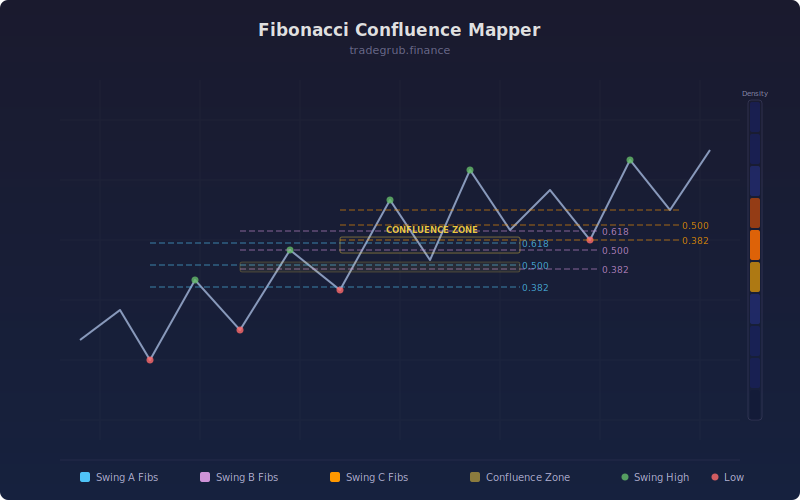

# Fibonacci Confluence Mapper

Automatically finds multiple swing highs and lows, draws Fibonacci retracements from each, then identifies "confluence zones" where multiple Fibonacci levels from different swings cluster together. These zones highlight high-probability support and resistance areas.

## Conceptual Diagram

## Parameters

- **Zigzag Length**: Number of bars used to detect swing highs and lows (default: 10)
- **Number of Swing Pairs**: How many recent swings to analyze (default: 4)
- **Zone Width (ATR multiplier)**: Controls how close Fibonacci levels must be to count as a cluster (default: 0.5)

## Signals

- **Gold horizontal line**: Strongest confluence zone with 3 or more overlapping Fibonacci levels
- **Cyan horizontal line**: Second strongest confluence zone
- **Gold background highlight**: Price is currently inside a confluence zone
- **Confluence Strength histogram**: Shows how many Fibonacci levels cluster near the current price
- **Dashed Fib lines**: Individual retracement levels from the most recent swing pair

## How It Works

1. The indicator scans recent price action to find swing highs and swing lows using a zigzag-style detection method.
2. For each combination of swing high and swing low, it calculates Fibonacci retracement levels at 23.6%, 38.2%, 50%, 61.8%, and 78.6%.
3. All calculated levels are grouped into price zones based on ATR. The zone width input controls the grouping sensitivity.
4. Zones where 3 or more Fibonacci levels from different swings overlap are marked as confluence zones.
5. The strongest confluence zones are drawn as horizontal lines on the chart.
6. When price enters a confluence zone, the background highlights to alert you to a high-probability support or resistance area.
