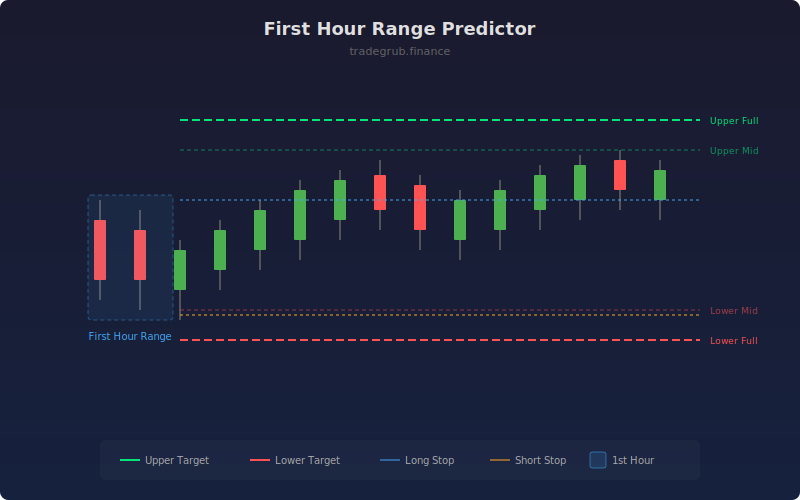

# First Hour Range Predictor

Analyzes the initial trading range of each session to project potential daily price targets and stop levels. Based on the statistical relationship between early-session volatility and total daily range, this indicator sets actionable intraday levels.

## How It Works

- Measures the high-low range of the first few bars in each session as the "first hour range"
- Calculates a rolling average of first-hour ranges over the lookback period
- Projects upper and lower price targets at configurable multipliers from the session midpoint
- Sets stop levels at the first-hour high (short stop) and low (long stop)
- Targets update each session based on historical range behavior

## Parameters

| Parameter | Default | Range | Description |
|-----------|---------|-------|-------------|
| Lookback Period | 20 | 5-100 | Number of sessions to average for range prediction |
| Mid Target Multiplier | 1.5 | 0.5-5.0 | Multiplier for intermediate price targets |
| Full Target Multiplier | 2.0 | 1.0-5.0 | Multiplier for full extension price targets |
| Show Stop Levels | true | - | Toggle display of stop loss levels |

## Outputs

- **Upper Full Target**: Maximum upside projection (green solid)
- **Upper Mid Target**: Intermediate upside level (green faded)
- **Lower Mid Target**: Intermediate downside level (red faded)
- **Lower Full Target**: Maximum downside projection (red solid)
- **Long Stop**: Protective stop for long positions (blue)
- **Short Stop**: Protective stop for short positions (orange)

## Usage Notes

- Works best on intraday timeframes where session boundaries are meaningful
- Compare actual price movement against projected targets to gauge session strength
- Use mid targets for conservative entries and full targets for trend-following exits
