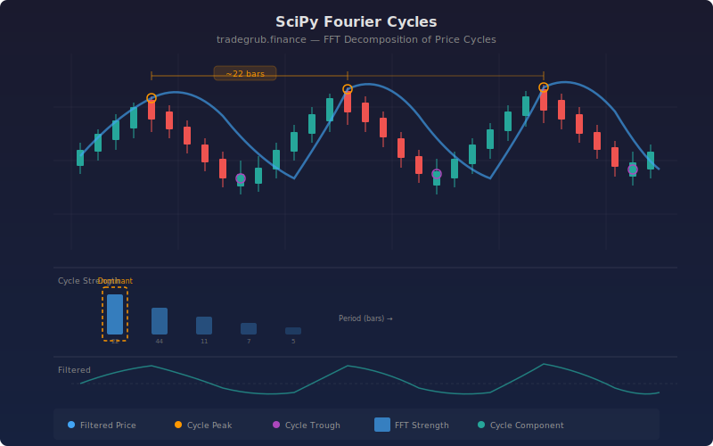

# Fourier Cycle Analysis

Decomposes price data into its frequency components using scipy.fft, then identifies the dominant cycles driving price movement. The indicator shows cycle strength (how much of price action is explained by regular cycles) and a filtered price reconstruction based on only the top N frequency components. Strong cycle readings suggest the market is in a rhythmic pattern that may continue.

## Conceptual Diagram



## How It Works

The indicator first detrends price by subtracting a long moving average, isolating the oscillating component. It then applies the Real Fast Fourier Transform (rfft) to convert the detrended price from the time domain into the frequency domain, producing a spectrum of magnitudes at each frequency.

Frequencies are filtered to only consider cycles between the minimum and maximum period settings. From the remaining frequencies, the top N strongest components are selected. The ratio of power in these top components to total power in the valid range becomes the cycle strength percentage.

A separate filtered price is reconstructed by taking the inverse FFT (irfft) using only the top N frequency components. This produces a smooth oscillating curve that shows only the dominant rhythmic pattern in price, stripped of noise and trend.

Cycle strength above 60% indicates that a few dominant frequencies explain most of the price oscillation, suggesting a tradeable rhythm. Below 30%, price movement is essentially random with no dominant cycle.

## Parameters

| Parameter | Default | Range | Description |
| --------- | ------- | ----- | ----------- |
| Top N Frequencies | 3 | 1-10 | Number of strongest frequency components to track |
| Min Cycle Period | 5 | 2-50 | Shortest cycle period to consider (in bars) |
| Max Cycle Period | 100 | 20-500 | Longest cycle period to consider (in bars) |
| Strength Smoothing | 5 | 1-20 | Smoothing period applied to the cycle strength output |

## Python Advantage

Scipy provides optimized FFT routines that handle the full frequency decomposition in a single call:

```python
from scipy.fft import rfft, rfftfreq, irfft

spectrum = rfft(detrended)
freqs = rfftfreq(n, d=1.0)
filtered = irfft(top_spectrum, n=n)
```

The rfft function is optimized for real-valued input (price data), producing a compact one-sided spectrum. irfft reconstructs the time-domain signal from selected frequency components.

## When to Use

This indicator is most useful on instruments and timeframes where cyclical behavior is expected: commodities with seasonal patterns, indices with regular rotation patterns, or any instrument during range-bound periods. Apply it on daily or 4-hour charts for the clearest cycle detection.

## Combining with Other Indicators

- **SciPy Peak Reversal**: When cycle strength is high, peak reversal signals at the extremes of the filtered price carry more weight
- **RSI or Stochastic**: Time entries at cycle extremes when the oscillator confirms overbought/oversold conditions
- **ATR Breakout**: Low cycle strength (random movement) may precede breakout conditions as the market shifts from cyclical to trending behavior
