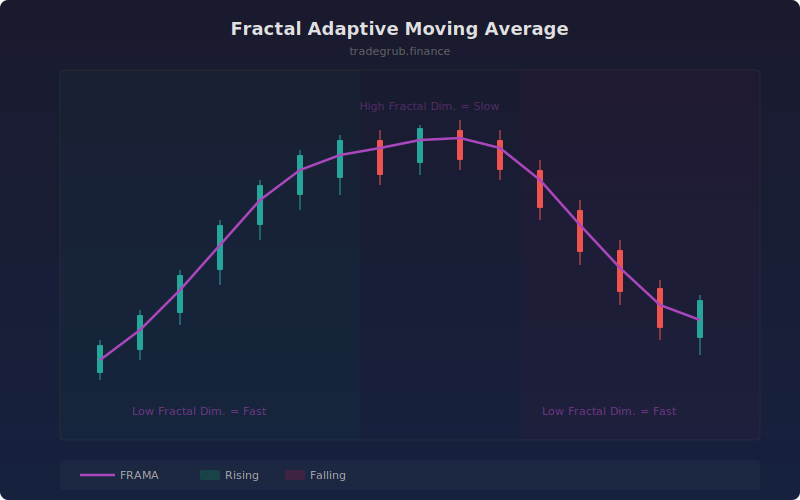

# Fractal Adaptive Moving Average

Moving average that adapts its smoothing period based on the fractal dimension of the price series. When price moves in a clean trend (low fractal dimension), the MA speeds up. In noisy, choppy conditions (high fractal dimension), it slows down to filter noise.

## How It Works

- Splits the lookback window into two halves and calculates the price range for each half and the full window
- Derives the fractal dimension from the ratio of half-period ranges to the full-period range
- Converts the fractal dimension into an exponential smoothing alpha factor
- Lower fractal dimension (trending) produces higher alpha (faster response)
- Higher fractal dimension (choppy) produces lower alpha (more smoothing)

## Parameters

| Parameter | Default | Range | Description |
|-----------|---------|-------|-------------|
| Length | 16 | 4-100 | Lookback period (must be even for clean half-split) |

## Outputs

- **FRAMA (purple)**: The fractal-adaptive moving average on price
- **Background**: Green tint for rising, red tint for falling

## Usage Notes

- Works best with even-numbered lengths since the algorithm splits the window in half
- In strong trends, FRAMA closely tracks price similar to a short EMA
- During consolidation, FRAMA flattens out and acts more like a long-period SMA
