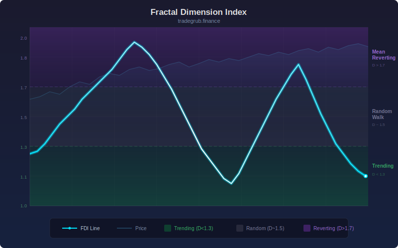

# Fractal Dimension Index

Measures the fractal dimension of price action using rescaled range (R/S) analysis to compute the Hurst exponent. The fractal dimension D = 2 - H, where H is the Hurst exponent. Values near 1.0 indicate strong trending behavior, near 1.5 indicate a random walk, and near 2.0 indicate mean-reverting behavior.

## Conceptual Diagram

## Parameters

| Parameter | Default | Range | Description |
|-----------|---------|-------|-------------|
| Length | 30 | 10-100 | Rolling window for R/S analysis |

## Signals

- D below 1.3: strong trending regime, use trend-following strategies
- D near 1.5: random walk, no edge for directional strategies
- D above 1.7: mean-reverting regime, use mean-reversion strategies
- Transitions between zones: regime shifts, adjust strategy accordingly

## Usage

Use as a regime filter to select the appropriate trading strategy. Apply trend-following when D is low and mean-reversion when D is high. Avoid trading when D is near 1.5 as the market behaves randomly.
