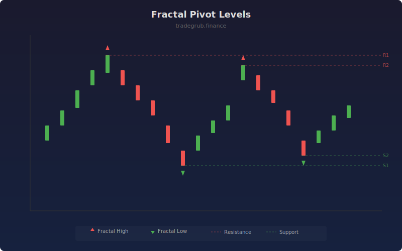

# Fractal Pivot Levels

Identifies Williams fractal highs and lows, then extends them as horizontal support and resistance levels. Fractals mark local turning points where price reversed, making them natural pivot levels for future price interaction.

## How It Works

- Detects fractal highs where the bar's high exceeds the highs of N bars on each side
- Detects fractal lows where the bar's low is below the lows of N bars on each side
- Extends the most recent fractal levels as horizontal lines to the current bar
- Tracks the nearest resistance (fractal high) and support (fractal low) relative to price
- Limits displayed levels to avoid clutter on the chart

## Parameters

| Parameter | Default | Range | Description |
|-----------|---------|-------|-------------|
| Fractal Period | 5 | 2-20 | Bars on each side for fractal confirmation |
| Max Levels | 5 | 1-10 | Maximum number of levels to display |
| Show Labels | true | - | Display R/S labels at fractal points |

## Outputs

- **Fractal High**: Triangle markers above fractal high bars
- **Fractal Low**: Triangle markers below fractal low bars
- **Nearest Resistance**: Closest fractal resistance to current price
- **Nearest Support**: Closest fractal support to current price

## Usage Notes

- Higher fractal period produces fewer but more significant pivot levels
- Levels that hold multiple times gain significance as proven support/resistance
- Works on all timeframes; larger periods suit higher timeframes
