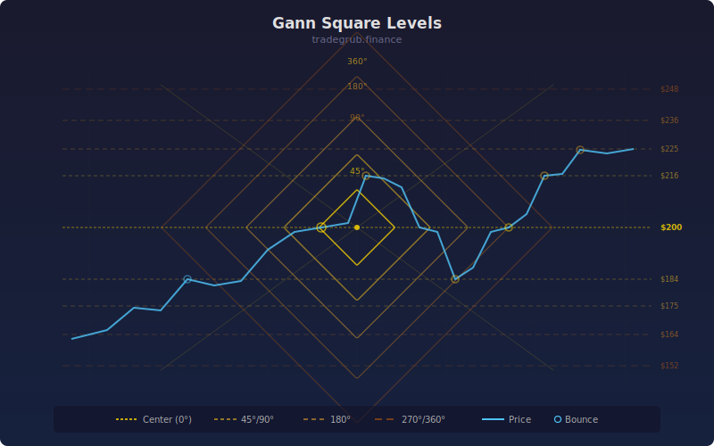

# Gann Square Levels

Calculates support and resistance levels using W.D. Gann's Square of Nine method. The indicator finds significant highs and lows within a lookback window, then projects price levels at key angular intervals (90, 180, 270, 360 degrees) using the square root transformation.

## Conceptual Diagram

## Parameters

- **Lookback Period** (default 50): Number of bars to scan for the reference high and low prices.
- **Levels Above** (default 4): Number of full Gann cycles to project above the reference high (each cycle has four sub-levels at 90, 180, 270, and 360 degrees).
- **Levels Below** (default 4): Number of full Gann cycles to project below the reference low.

## How It Works

1. The indicator finds the highest high and lowest low over the lookback period.
2. It takes the square root of each reference price.
3. For resistance levels: adds increments of 0.25 (90 degrees), 0.5 (180 degrees), 0.75 (270 degrees), and 1.0 (360 degrees) to the square root of the high, then squares the result.
4. For support levels: subtracts the same increments from the square root of the low, then squares the result.
5. Each full cycle (360 degree level) represents a complete rotation on the Gann wheel.

## Signals

- **360 degree levels** (bold color): Strongest support/resistance. Price often stalls or reverses at these levels.
- **180 degree levels** (medium color): Moderate significance. Halfway points in the Gann cycle frequently act as pivot zones.
- **90 and 270 degree levels** (light color): Minor support/resistance. Useful for short-term targets and stop placement.
- Resistance levels are colored in red shades; support levels in green shades.
- When price clusters near a Gann level, watch for confirmation from volume or candlestick patterns before trading the level.
