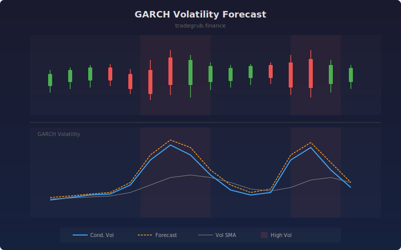

# GARCH Volatility Forecast

Implements a GARCH(1,1) model to estimate and forecast conditional volatility. Unlike simple historical volatility, GARCH captures volatility clustering -- the tendency for large moves to follow large moves -- providing a forward-looking estimate of market risk.

## How It Works

- Computes log returns from price data to measure percentage changes
- Estimates conditional variance recursively using the GARCH(1,1) equation
- Alpha parameter controls sensitivity to recent shocks; beta controls persistence
- Projects volatility forward by the specified forecast horizon using the mean-reversion property
- Highlights periods of elevated volatility when current vol exceeds 1.5x its moving average

## Parameters

| Parameter | Default | Range | Description |
|-----------|---------|-------|-------------|
| Omega Weight | 0.1 | 0.01-1.0 | Weight for long-run variance baseline |
| Alpha (Shock) | 0.1 | 0.01-0.5 | Sensitivity to recent return shocks |
| Beta (Persistence) | 0.85 | 0.1-0.99 | Persistence of previous volatility |
| Forecast Horizon | 5 | 1-20 | Bars ahead to forecast volatility |

## Outputs

- **Conditional Vol**: Current estimated volatility (blue line)
- **Forecast Vol**: Forward-looking volatility estimate (orange line)
- **Vol SMA(20)**: 20-period average of conditional volatility (gray line)
- **High Vol Shading**: Red background when volatility is elevated

## Usage Notes

- Alpha + Beta should stay below 1.0 for model stability; values near 1.0 indicate very persistent volatility
- When forecast vol diverges above conditional vol, expect continued elevated volatility
- Use high volatility shading to identify periods where position sizing should be reduced
