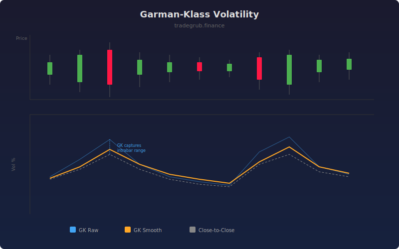

# Garman-Klass Volatility

The Garman-Klass volatility estimator uses open, high, low, and close prices to produce a more statistically efficient estimate of volatility than the traditional close-to-close method. By incorporating the full intrabar price range, it captures information that closing prices alone miss.

## How It Works

- Computes the Garman-Klass variance using log(high/low) and log(close/open) ratios
- The formula weights the high-low range and the open-close range with theoretically optimal coefficients
- Averages the per-bar variance over the lookback window
- Annualizes and converts to percentage for intuitive interpretation
- Optionally overlays close-to-close volatility for comparison

## Parameters

| Parameter | Default | Range | Description |
|-----------|---------|-------|-------------|
| Length | 20 | 5-100 | Rolling window for variance averaging |
| Annualization Factor | 252 | 1-365 | Trading days per year |
| Smoothing | 5 | 1-20 | SMA smoothing period |
| Show Close-to-Close | true | - | Display traditional volatility for comparison |

## Outputs

- **GK Volatility**: Raw Garman-Klass annualized volatility
- **GK Smooth**: Smoothed version for cleaner reading
- **Close-to-Close Vol**: Traditional volatility for comparison (optional)

## Usage Notes

- GK volatility is roughly 8x more efficient than close-to-close, meaning it converges faster with fewer data points
- When GK diverges significantly above close-to-close, it reveals large intrabar moves not captured by closes
- Useful for position sizing, risk management, and identifying volatility regime changes
