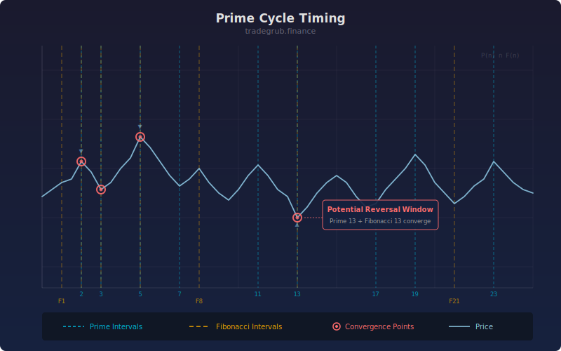

# Prime Cycle Timing

Number theory swing timing indicator that identifies potential reversal windows when the bar count since the last significant swing hits prime numbers or Fibonacci numbers.

## Conceptual Diagram

## Parameters

- **Swing Threshold** (default 2.0): ATR multiplier defining what constitutes a significant swing. Higher values require larger moves to reset the count.

## How It Works

The indicator tracks the number of bars since the last significant price swing (defined as a move exceeding the ATR multiplied by the threshold). When this count reaches a prime number, the bar is marked as a potential timing window.

A timing score (0 to 100) indicates proximity to the next prime number count. Bars where the count is both a prime and Fibonacci number receive maximum confluence scores.

Primes are generated via numpy sieve of Eratosthenes. Fibonacci numbers are computed up to 500.

## Signals

- **Triangle markers**: Bar count since last swing is a prime number
- **Score above 80**: Very close to or at a prime timing window
- **Prime-Fibonacci confluence**: Maximum timing score, strongest reversal potential

## Usage

Use as a supplementary timing tool alongside other reversal or momentum indicators. When the timing score peaks at a prime-Fibonacci confluence while other indicators show divergence or exhaustion, the probability of a reversal increases.
