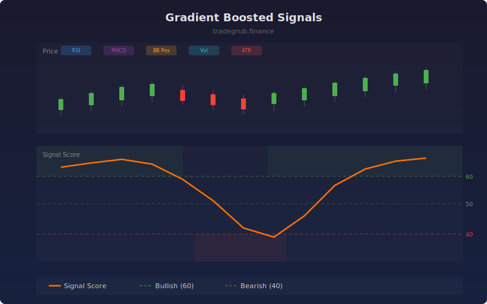

# Gradient Boosted Signals

Combines RSI, MACD histogram, Bollinger Band position, volume ratio, and normalized ATR into a gradient boosted tree ensemble that produces a single composite signal score. Falls back to a numpy-based linear model when the boosting library is unavailable.

## How It Works

- Extracts five technical features: RSI, MACD histogram, BB position, volume ratio, and normalized ATR
- Trains a gradient boosted classifier on a rolling window to predict 3-bar forward returns
- Outputs a composite signal score from 0 (strongly bearish) to 100 (strongly bullish)
- Applies 3-bar smoothing to reduce noise in the probability output
- Automatically falls back to a numpy least-squares model if the boosting library is not installed

## Parameters

| Parameter | Default | Range | Description |
|-----------|---------|-------|-------------|
| Feature Length | 14 | 5-50 | Period for RSI and ATR feature calculations |
| Training Window | 80 | 40-150 | Rolling window for model training |
| Signal Threshold | 0.60 | 0.50-0.90 | Score level for bullish/bearish classification |

## Outputs

- **Signal Score**: Composite ML signal score (orange line, 0-100)
- **Bullish Threshold**: Dashed green line at threshold level
- **Bearish Threshold**: Dashed red line at inverse threshold level
- **Background**: Green shading above bullish threshold, red below bearish

## Usage Notes

- Signal score above the bullish threshold indicates the ensemble sees favorable conditions across multiple indicators
- Divergence between signal score and price can indicate exhaustion or hidden strength
- The model retrains each bar on the rolling window, adapting to recent market behavior
