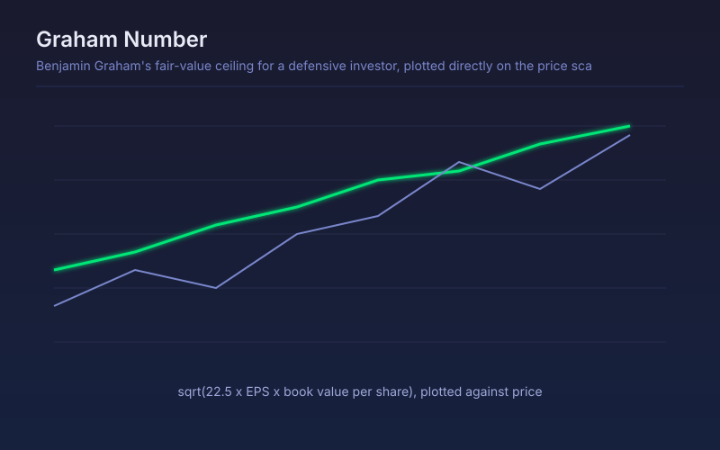

# Graham Number

Benjamin Graham's fair-value ceiling for a defensive investor, plotted directly on the price scale alongside price.

## Conceptual Diagram

## Parameters

| Parameter | Default | Range | Description |
|-----------|---------|-------|-------------|
| Reporting period | FY | FY or FQ | Annual or quarterly statements used for EPS and book value |
| Margin of safety % | 0.0 | 0-50 | Discount applied below the raw Graham Number before plotting |

## Signals

- Price below the line: trading under Graham's defensive ceiling
- Price above the line: above fair value on Graham's terms, whatever the growth story
- No line at all: earnings or book value are not positive, which fails the screen outright
- Shaded background marks every bar where price sits below the number

## Usage

Use on established, profitable businesses where book value still means something. It is deliberately conservative and will exclude most asset-light growth companies, which is the intended behaviour rather than a limitation.

## Data Requirements

This script reads filed financial statements through `request.financial()`, so it
needs fundamental data for the charted symbol. On instruments without filed
statements, such as crypto pairs, forex and most indices, the series is empty and
nothing plots. Values step only at each filing date and stay flat in between.
