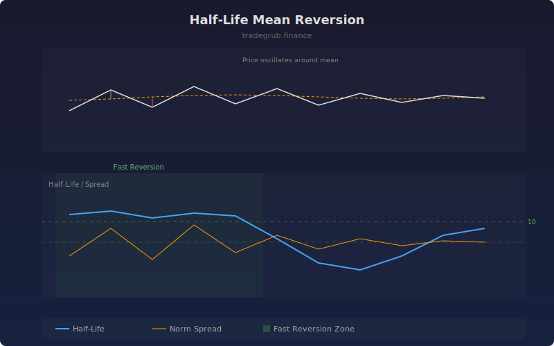

# Half-Life Mean Reversion

The Half-Life Mean Reversion indicator estimates how many bars it takes for a price deviation from its mean to decay by half. By regressing the change in spread on the lagged spread value, it quantifies the speed at which prices revert to equilibrium, helping traders set appropriate holding periods for mean-reversion strategies.

## How It Works

- Calculates the spread between price and its moving average
- Regresses the change in spread on the prior spread level (AR(1) model)
- Derives the half-life from the regression coefficient: HL = -ln(2) / beta
- Shorter half-life values indicate faster mean reversion
- Also displays the normalized spread (z-score) for trade timing

## Parameters

| Parameter | Default | Range | Description |
|-----------|---------|-------|-------------|
| Lookback Length | 60 | 20-300 | Window for regression calculation |
| Mean Length | 20 | 5-100 | Moving average period for the mean |

## Outputs

- **Half-Life (bars)**: Estimated bars to revert halfway to mean (blue line)
- **Norm Spread**: Normalized deviation from mean (orange line)
- **Background**: Green shading when half-life is below 10 bars (fast reversion)

## Usage Notes

- Half-life below 10 bars suggests quick reversion suitable for short-term trading
- Very large half-life values indicate trending conditions where mean reversion is weak
- Use the normalized spread to time entries when the half-life confirms mean-reverting behavior
