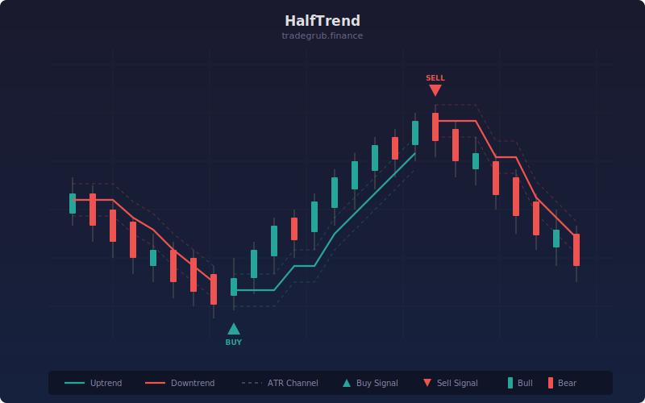

# HalfTrend Indicator

ATR-based trend indicator that tracks the midpoint of an ATR channel and flips direction when price breaks the channel boundary. Plots a stepped trend line with green/red coloring and arrow signals at flip points.

## Conceptual Diagram

## Parameters

- **Channel Length:** Lookback period for the highest-high and lowest-low channel (default: 2)
- **ATR Amplitude:** Multiplier applied to ATR for channel offset distance (default: 2.0)

## Signals

- **Green trend line:** Bullish trend is active. The line steps upward, tracking the low channel minus the ATR offset.
- **Red trend line:** Bearish trend is active. The line steps downward, tracking the high channel plus the ATR offset.
- **Up arrow:** Trend has flipped from bearish to bullish.
- **Down arrow:** Trend has flipped from bullish to bearish.

## How It Works

1. The indicator calculates a channel using the highest high and lowest low over the lookback period.
2. An ATR-based offset is applied to the channel boundaries. During a bullish trend, the trend line sits below price at `lowest_low - ATR * amplitude`. During a bearish trend, it sits above price at `highest_high + ATR * amplitude`.
3. The trend line only moves in the direction of the trend: it ratchets upward in bull mode and downward in bear mode, never retracing.
4. When the close crosses the trend line against the current direction, the trend flips. The line snaps to the opposite channel boundary and an arrow signal marks the reversal bar.
