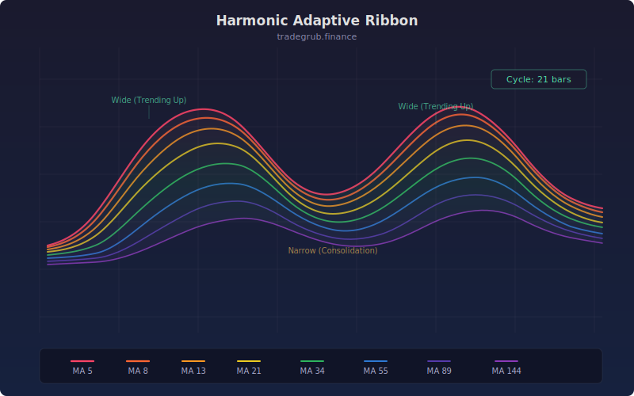

# Harmonic Adaptive Ribbon

Auto-tuned moving average ribbon that detects the dominant market cycle using autocorrelation analysis and generates ribbon lines at harmonic multiples.

## Conceptual Diagram

## Parameters

- **Min Period** (default 5): Minimum cycle period to search for in autocorrelation analysis
- **Max Period** (default 60): Maximum cycle period to search for in autocorrelation analysis

## How It Works

The indicator scans for the dominant cycle in price data by computing autocorrelation across a range of lags. The lag with the highest autocorrelation is selected as the dominant cycle length.

Four EMA ribbon lines are then plotted at harmonic multiples of the detected cycle:
- Cycle / 4 (fastest)
- Cycle / 2
- Cycle (base)
- Cycle * 2 (slowest)

## Signals

- **Bullish alignment**: All four ribbons are stacked in order (fastest on top). Lines turn green.
- **Bearish alignment**: All four ribbons are inverted (fastest on bottom). Lines turn red.
- **Mixed alignment**: Ribbons are interleaved, indicating consolidation or transition. Lines turn orange.

## Usage

Use this indicator as an overlay on price charts to identify the current trend regime and its strength. When all ribbons align, the trend is strong. When ribbons cross or interleave, expect choppy conditions or a potential reversal.
