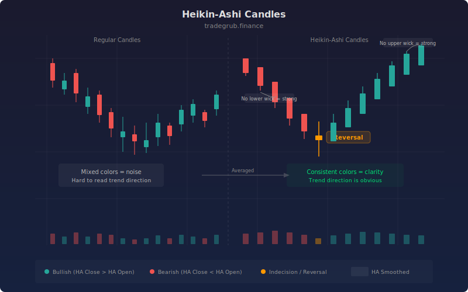

# Heikin-Ashi Candles

Heikin-Ashi (Japanese for "average bar") is a candlestick modification technique that smooths price data by averaging current and prior bar values. Invented in 18th-century Japan alongside traditional candlestick charting, Heikin-Ashi candles reduce noise and make trend direction visually obvious. Consecutive same-color candles indicate sustained trends, while color changes and small bodies signal potential reversals.

## Conceptual Diagram



## How It Works

Heikin-Ashi candles recalculate the four OHLC values using averages. The HA close is computed as the average of the original open, high, low, and close: (O + H + L + C) / 4. This single averaging step already smooths out much of the bar-to-bar noise in closing prices.

The HA open is derived from the previous HA candle. It is the simple moving average of the previous open and close over a 2-bar window. This recursive averaging creates a smoothing effect that compounds over time, producing cleaner open-to-close bodies that better represent the prevailing trend direction.

The HA high and HA low retain the actual bar extremes via `ta.highest(high, 1)` and `ta.lowest(low, 1)`, preserving the true range information. This means wicks still reflect real price excursions, but the body of each candle (the range between HA open and HA close) is smoothed.

The visual interpretation is straightforward. Long green bodies with no lower wick indicate strong bullish momentum. Long red bodies with no upper wick indicate strong bearish momentum. Small bodies with long wicks on both sides signal indecision and potential turning points. A color change from green to red (or vice versa) is the primary signal of trend reversal.

An optional parameter allows displaying the original real candles alongside the Heikin-Ashi overlay, letting you compare smoothed signals against actual price action for order placement.

## Parameters

| Parameter | Default | Range | Description |
|-----------|---------|-------|-------------|
| Show Real Candles Too | false | Boolean | Display original OHLC candles alongside the HA overlay |

## Python Advantage

The HA calculation leverages vectorized array arithmetic for all four components, computing every bar simultaneously rather than iterating with recursive variable assignments:

```python
# Vectorized Heikin-Ashi computation — all bars at once
ha_close = (open + high + low + close) / 4
ha_open = ta.sma((open + close) / 2, 2)
ha_high = ta.highest(high, 1)
ha_low = ta.lowest(low, 1)

# Single call renders the entire candle series
plotcandle(ha_open, ha_high, ha_low, ha_close, title="Heikin-Ashi")
```

The `plotcandle` function accepts four arrays and renders the complete candle series in one call. In Pine, the HA open requires a recursive variable assignment (`ha_open := ...`) that must execute bar-by-bar. Python's SMA-based approach achieves the same smoothing through array operations, and the entire OHLC transformation is expressed in four lines of pure array math. You could extend this with conditional coloring like `np.where(ha_close > ha_open, "green", "red")` for custom candle color arrays.

## When to Use

Heikin-Ashi candles are best suited for swing trading and trend following on daily and 4-hour charts. They excel at keeping you in trends longer by smoothing out minor pullbacks that would trigger exits on regular candles. They work on all asset classes. Avoid using HA candles for precise entry and exit pricing, as the averaged values differ from actual market prices. Use them for directional decisions and real candles for order placement.

## Risk Management

Because Heikin-Ashi smooths prices, entries and exits based on HA values will differ from actual fill prices. Always place orders using real price levels, not HA values. Set stops based on actual support/resistance or ATR rather than HA candle extremes. The smoothing also introduces lag, so reversals appear 1-2 bars later than on real candles. In fast-moving markets, this lag can result in significant slippage.

## Combining with Other Indicators

- **EMA Ribbon**: Overlay the EMA Ribbon on Heikin-Ashi candles for a double-smoothed trend view that filters nearly all noise from the chart.
- **Trend Strength**: Use the Trend Strength score to confirm that Heikin-Ashi color sequences reflect genuine trend conviction rather than low-volatility drift.
- **ATR Percent**: Since HA candles mask true volatility, pair with ATR Percent to maintain awareness of actual market volatility during smoothed trend signals.
