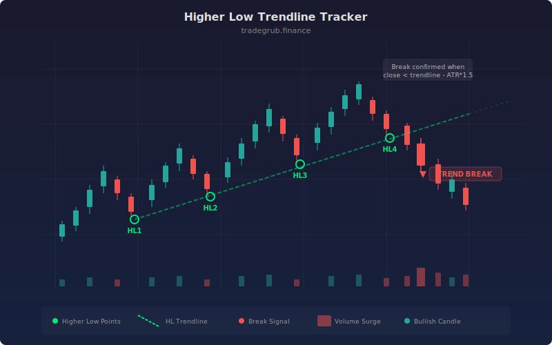

# Higher Low Trendline Tracker

The Higher Low Trendline Tracker identifies and draws trendlines along successive higher lows and lower highs in price action. It monitors the structural integrity of these trendlines in real time and flags breaks, giving traders an objective view of trend health without manual drawing.

## Conceptual Diagram



## How It Works

The indicator smooths price data using a simple moving average, then scans for swing lows and swing highs over a configurable lookback window. When it detects a new swing low that is higher than the previous one, it increments a counter. Once the required number of successive higher lows is reached, a trendline is drawn connecting the anchor points with linear interpolation.

The same logic runs in reverse for lower highs, tracking downtrend structure. Trendline values are projected forward from each new swing point so the line extends across the chart as a visual reference.

Break detection uses ATR as a volatility filter. A higher low trendline break triggers only when the close falls below the projected trendline value by more than the ATR multiplied by a user-defined factor. This prevents false signals from normal noise. Background coloring and shape markers highlight break events on the chart.

## Parameters

| Name | Default | Range | Description |
|------|---------|-------|-------------|
| Swing Length | 5 | 2 - 50 | Lookback window for detecting swing highs and lows |
| Min Touches | 3 | 2 - 10 | Minimum number of successive higher lows or lower highs before drawing a trendline |
| Break ATR Mult | 1.5 | 0.5 - 5.0 | ATR multiplier threshold for confirming a trendline break |
| ATR Length | 14 | 5 - 50 | Period for ATR calculation used in break detection |
| Show HL Trendline | True | on/off | Toggle display of the higher low trendline |
| Show LH Trendline | True | on/off | Toggle display of the lower high trendline |
| Smooth Length | 3 | 1 - 10 | SMA period applied to price before swing detection |
| Alert on Break | True | on/off | Enable break alert signals |

## Python Advantage

Vectorized swing detection runs efficiently over large datasets:

```python
smoothed_low = ta.sma(low, smooth_len)
swing_low = ta.lowest(smoothed_low, swing_len)
is_swing_low = (smoothed_low == swing_low)
```

The `ta.lowest` function processes the entire array in one call, and boolean comparison produces a mask without any loop overhead. ATR-based filtering is also fully vectorized:

```python
atr = ta.atr(atr_len)
hl_break = close < hl_trendline - break_atr_mult * atr
```

## When to Use

This indicator works best on trending instruments where price establishes a clear pattern of higher lows or lower highs over multiple swings. It is well suited for swing trading timeframes (daily, 4H) but adapts to intraday charts by adjusting the swing length and smoothing parameters. Use it to confirm trend continuation or to get early warning that a trend is losing structural support.

## Risk Management

A trendline break does not guarantee a reversal. Always confirm breaks with volume or momentum before acting. The ATR multiplier parameter controls sensitivity: higher values reduce false signals but delay detection. Consider using wider multipliers on volatile instruments and tighter values on stable, trending markets.

## Combining with Other Indicators

- **RSI divergence:** When RSI makes lower highs while price makes higher lows, the structure may be weakening before the trendline officially breaks.
- **Volume profile:** Validate trendline touches with above-average volume at swing lows to confirm institutional participation.
- **Moving average confluence:** A higher low trendline that aligns with a key moving average (50 or 200 SMA) creates a stronger support zone.
