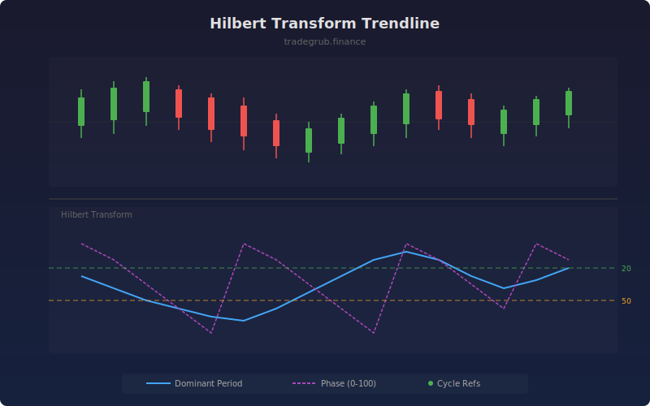

# Hilbert Transform Trendline

Uses the Hilbert Transform to extract instantaneous phase and dominant cycle period from price data. This indicator helps identify the prevailing market cycle length and phase, enabling traders to align entries with the dominant rhythm of price movement.

## How It Works

- Detrends price by subtracting a simple moving average to isolate the cyclical component
- Applies the Hilbert Transform to compute the analytic signal (amplitude and phase)
- Calculates instantaneous frequency from phase differences to determine the dominant period
- Normalizes phase to a 0-100 range for easy interpretation of cycle position
- Smooths outputs to reduce noise and improve readability

## Parameters

| Parameter | Default | Range | Description |
|-----------|---------|-------|-------------|
| Smoothing Length | 20 | 5-100 | Moving average length for detrending |
| Source Smoothing | 5 | 1-20 | Pre-smoothing applied to price data |

## Outputs

- **Dominant Period**: Estimated dominant cycle length in bars (blue line)
- **Phase (0-100)**: Current position within the cycle (purple line)
- **Fast Cycle**: Reference line at 20 bars (green dashed)
- **Medium Cycle**: Reference line at 50 bars (orange dashed)

## Usage Notes

- When dominant period is low (near 20), the market is cycling quickly and shorter-term strategies may work better
- Phase crossing above 50 suggests the cycle is in its second half, potentially approaching a turning point
- Combine with trend indicators to distinguish trending vs cycling market conditions
