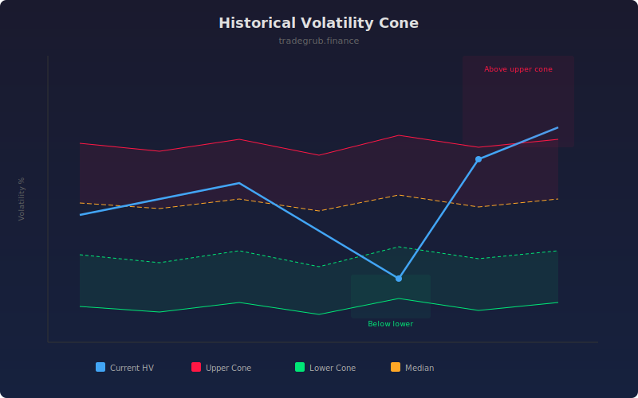

# Historical Volatility Cone

The Historical Volatility Cone calculates annualized volatility across multiple lookback periods and plots percentile bands, showing where current volatility sits relative to its historical range. This helps identify whether volatility is unusually high or low, informing position sizing and options-related decisions.

## How It Works

- Computes log returns from close prices
- Calculates annualized standard deviation across multiple lookback windows (1x, 2x, 3x the base length)
- Derives upper percentile, lower percentile, and median from the multi-period volatility readings
- Plots current short-term volatility against the cone boundaries
- Highlights when current volatility breaks above or below the cone

## Parameters

| Parameter | Default | Range | Description |
|-----------|---------|-------|-------------|
| Base Length | 20 | 5-100 | Shortest lookback period for volatility calculation |
| Annualization Factor | 252 | 1-365 | Trading days per year for annualization |
| Lower Percentile | 25.0 | 5-45 | Lower boundary percentile |
| Upper Percentile | 75.0 | 55-95 | Upper boundary percentile |

## Outputs

- **Current HV**: Short-term annualized historical volatility
- **Upper Cone**: Upper percentile boundary
- **Lower Cone**: Lower percentile boundary
- **Median**: Median volatility across periods
- **Background**: Red tint when above upper cone, green tint when below lower cone

## Usage Notes

- Volatility below the lower cone suggests a quiet period that often precedes a big move
- Volatility above the upper cone indicates extreme conditions that tend to mean-revert
- Use the cone position to adjust position sizes: smaller when volatility is elevated, larger when compressed
