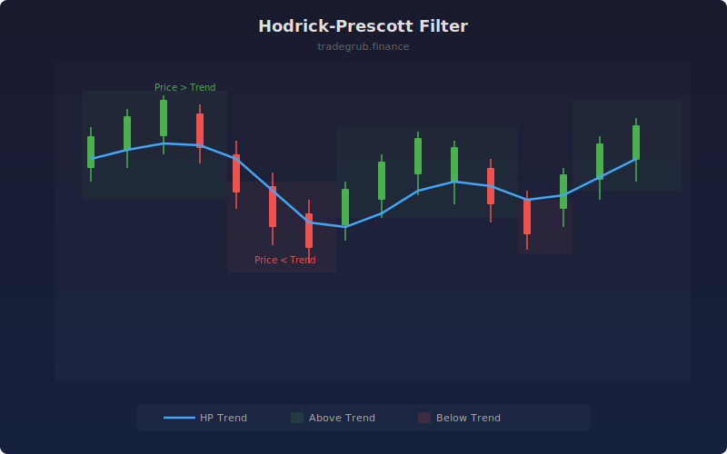

# Hodrick-Prescott Filter

Separates price into a smooth trend component and a cyclical component using the Hodrick-Prescott filter. Originally developed for macroeconomic time series, this filter provides an optimally smooth trend line while preserving important structural movements.

## How It Works

- Solves an optimization problem that balances fit to data against trend smoothness
- Lambda parameter controls the tradeoff: higher values produce smoother trends
- Cyclical component (price minus trend) reveals overbought and oversold conditions
- Green background shading indicates price above trend, red indicates below trend
- Falls back to double-smoothed moving average if scipy is unavailable

## Parameters

| Parameter | Default | Range | Description |
|-----------|---------|-------|-------------|
| Lambda (Smoothness) | 1600 | 1-100000 | Smoothing parameter; higher = smoother trend |
| Show Cycle Component | true | on/off | Toggle cycle shading on chart |

## Outputs

- **HP Trend**: Smooth trend line overlaid on price (blue)
- **Cycle Shading**: Green when price is above trend, red when below

## Usage Notes

- Lambda of 1600 is the classic quarterly macro setting; for daily price data, try 100-400
- Price crossing through the HP trend line can signal trend changes
- The cycle component works well as a mean-reversion signal in ranging markets
