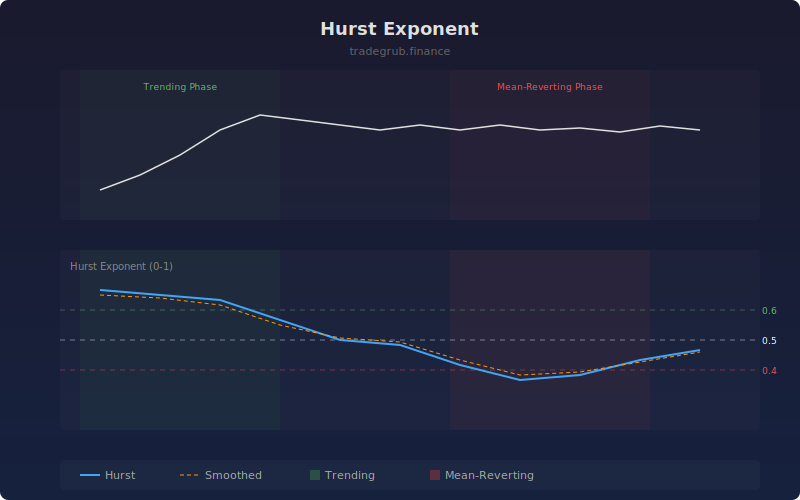

# Hurst Exponent

The Hurst Exponent estimates whether a price series tends to trend, mean-revert, or behave as a random walk. Values above 0.5 indicate persistent (trending) behavior, values below 0.5 suggest anti-persistent (mean-reverting) behavior, and values near 0.5 indicate a random walk with no exploitable pattern.

## How It Works

- Calculates price differences at multiple lag intervals within the lookback window
- Computes the standard deviation of lagged differences for each lag
- Fits a log-log regression of lag vs standard deviation to estimate the exponent
- Clamps the result between 0 and 1 for stability
- Provides a smoothed line for easier regime identification

## Parameters

| Parameter | Default | Range | Description |
|-----------|---------|-------|-------------|
| Lookback Length | 100 | 50-500 | Window size for Hurst calculation |
| Max Lag | 20 | 5-50 | Maximum lag for variance scaling analysis |

## Outputs

- **Hurst Exponent**: Raw H value (blue line, 0-1 range)
- **Smoothed**: Moving average of H (orange line)
- **Background**: Green for trending (H > 0.6), red for mean-reverting (H < 0.4)

## Usage Notes

- When H is above 0.6, trend-following strategies are more likely to succeed
- When H is below 0.4, mean-reversion strategies are favored
- The Hurst value changes over time, so monitor for regime transitions near 0.5
