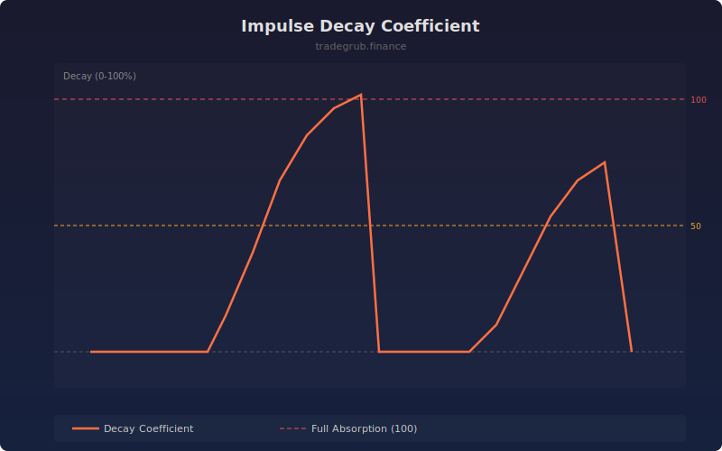

# Impulse Decay Coefficient

Measures how much an impulse move has been absorbed by the subsequent pullback. An impulse is detected when the ATR-normalized bar move exceeds a configurable multiplier. The decay coefficient tracks retracement as a percentage of the impulse size.

## How It Works

- Detects impulse bars where the price move exceeds ATR multiplied by the threshold
- Tracks subsequent retracement from the impulse price as a percentage of the impulse size
- Decay at 0 means no retracement; decay at 100 means the impulse is fully absorbed
- Resets after full absorption and waits for the next impulse

## Parameters

| Parameter | Default | Range | Description |
|-----------|---------|-------|-------------|
| ATR Multiplier | 2.0 | 1.0-5.0 | Minimum ATR multiple to qualify as an impulse |
| Lookback | 20 | 5-100 | ATR calculation period |

## Outputs

- **Decay Coefficient**: Orange line from 0 to 100+
- **Full Absorption**: Red line at 100
- **Half Absorbed**: Orange line at 50
- **Zero Line**: Gray baseline

## Usage Notes

- Decay below 50 after an impulse suggests the move still has momentum
- Decay reaching 100 means the impulse is fully retraced and a new setup may form
- Lower ATR multiplier catches smaller impulses but generates more signals
