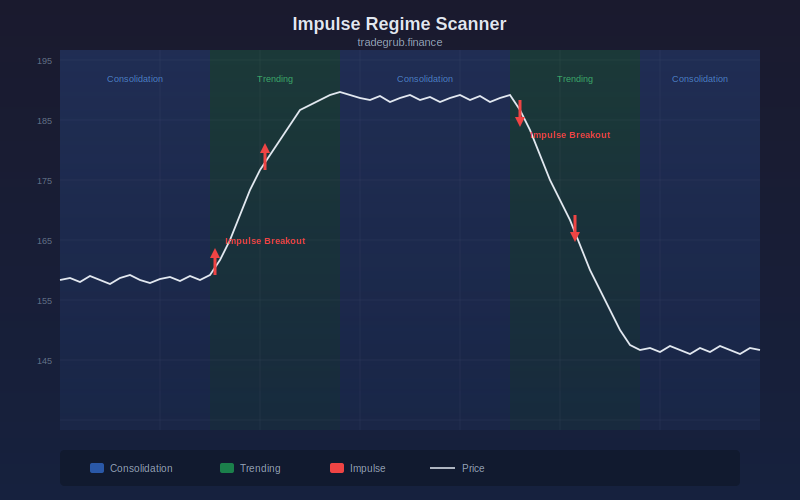

# Impulse Regime Scanner

Regime detection indicator identifying consolidation versus trending phases with impulse override system that detects breakout momentum spikes. This volatility indicator provides quantitative signals that can be applied to any liquid market across all timeframes.

## Conceptual Diagram



## How It Works

The indicator analyzes price data using volatility techniques to produce actionable signals.

Built-in technical functions used: `atr`. These provide the foundation for the indicator's calculations, computed efficiently across the full price history in a single pass.

Core techniques include ATR, iterative computation, mean computation, extremum detection. The computation processes all bars simultaneously using vectorized numpy operations, ensuring consistent results regardless of the dataset size.

Integer parameters control window lengths and thresholds, allowing the indicator to adapt from scalping on short timeframes to position trading on weekly charts. Shorter windows increase sensitivity to recent price action while longer windows provide smoother, more reliable signals.

Float parameters fine-tune sensitivity and scaling factors. Small adjustments to these values can significantly change signal frequency and quality, so test changes on historical data before applying to live trading.

## Parameters

| Parameter | Default | Range | Description |
|-----------|---------|-------|-------------|
| Consolidation Window | 20 | 10 - 60 | Controls consolidation window sensitivity (int) |
| ATR Length | 14 | 5 - 30 | Controls atr length sensitivity (int) |
| Impulse Threshold | 2.0 | 1.0 - 4.0 | Controls impulse threshold sensitivity (float) |

## Signals

- **Consolidation Score**: Primary visual output plotted as a continuous line on the chart
- **Impulse Strength**: Primary visual output plotted as a continuous line on the chart
- **Consolidation Zone** (70): Reference level for threshold-based decisions
- **Impulse Threshold** (impulse_mult * 30): Reference level for threshold-based decisions
- **Background shading**: Highlights active signal zones based on consolidating.tolist()
- **Background shading**: Highlights active signal zones based on impulse_bar.tolist()

## Python Advantage

The entire computation runs as vectorized numpy operations, processing all bars simultaneously rather than one at a time:

```python
cl = np.array(close, dtype=float)
hi = np.array(high, dtype=float)
lo = np.array(low, dtype=float)
n = len(cl)

atr_arr = np.array(ta.atr(high, low, close, atr_len), dtype=float)
atr_arr = np.nan_to_num(atr_arr, nan=1.0)

range_pct = np.zeros(n)
for i in range(consol_len, n):
```

Python's numpy arrays allow element-wise arithmetic across thousands of bars in a single expression. Adding custom variations or combining with other calculations is straightforward, requiring only standard array operations.

## When to Use

- Identify periods of expanding or contracting volatility
- Set dynamic stop-loss levels based on current market conditions
- Detect volatility squeezes that precede large moves
- Size positions appropriately for current market risk

Works best on daily and intraday charts for liquid instruments. Shorter parameter values suit scalping and day trading while longer values work for swing and position trading.

## Risk Management

No indicator is predictive on its own. Always define risk before entering a trade:

- Set stop-losses based on ATR or recent swing points, not arbitrary percentages
- Size positions so that a stop-loss hit risks no more than 1-2% of account equity
- Avoid adding to losing positions based solely on indicator readings
- Backtest parameter combinations on out-of-sample data before live trading

## Combining with Other Indicators

- **Moving Average Ribbon**: Use the Moving Average Ribbon to confirm the overall trend direction before acting on this indicator's signals. Trading in the direction of the ribbon produces higher win rates.
- **Volume Profile POC**: When this indicator's signal aligns with a high-volume node from the Volume Profile, the confluence creates a stronger setup with better follow-through.
- **RSI or Stochastic**: Add a momentum oscillator as a confirmation filter. Signals that align with oversold or overbought momentum readings tend to produce larger moves.
