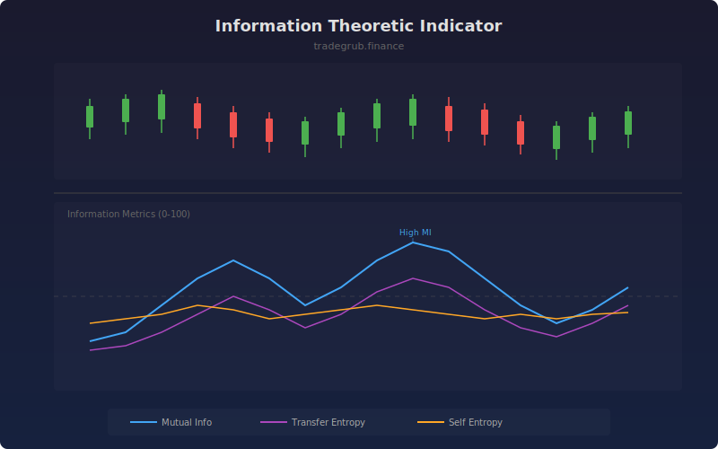

# Information Theoretic Indicator

Measures predictive relationships between price and volume using information theory. Mutual information captures any type of statistical dependency (linear or nonlinear), while transfer entropy measures directed information flow, revealing whether volume changes actually predict future price movements.

## How It Works

- Computes rolling mutual information between price returns and volume changes
- Calculates transfer entropy to measure directed information flow from volume to price
- Self entropy tracks the randomness/predictability of returns over the window
- All metrics are normalized to 0-100 for consistent interpretation
- Higher values indicate stronger relationships or greater uncertainty

## Parameters

| Parameter | Default | Range | Description |
|-----------|---------|-------|-------------|
| Window Length | 30 | 10-100 | Rolling window for information calculations |
| Histogram Bins | 10 | 5-30 | Bins for probability estimation (more = finer resolution) |
| Transfer Entropy Lag | 1 | 1-10 | Lag for directed information flow measurement |

## Outputs

- **Mutual Information**: Statistical dependency between returns and volume (blue)
- **Transfer Entropy**: Directed predictive information from volume to price (purple)
- **Self Entropy**: Randomness of return distribution (orange)

## Usage Notes

- High mutual information suggests volume and price are moving in sync, useful for confirmation
- Rising transfer entropy means volume is becoming more predictive of future price moves
- Low self entropy indicates predictable, orderly price behavior favorable for trend-following
