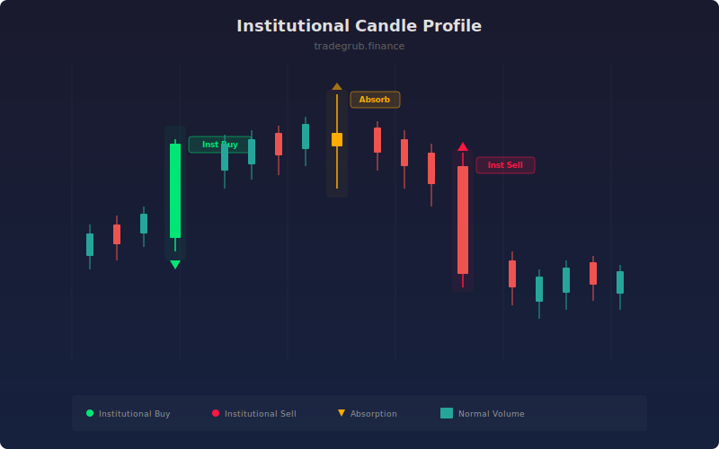

# Institutional Candle Profile

Identifies high-volume candles that signal institutional accumulation or distribution activity. The indicator distinguishes between directional institutional candles (large body, high volume) and absorption candles (small body, high volume with large wicks), each providing different market structure clues.

## How It Works

- Computes a volume moving average and flags bars where volume exceeds it by a configurable multiplier.
- Measures body-to-range ratio to classify candle structure.
- Large body + high volume = directional institutional candle (accumulation or distribution).
- Small body + high volume = absorption candle (supply or demand being absorbed).
- Labels and background shading mark each signal type with a cooldown to avoid clutter.

## Parameters

| Parameter | Default | Range | Description |
|-----------|---------|-------|-------------|
| Volume Multiplier | 2.0 | 1.0-5.0 | Volume must exceed its MA by this factor |
| Volume MA Length | 20 | 5-100 | Lookback for the volume moving average |
| Min Body Percent | 0.6 | 0.3-0.9 | Minimum body-to-range ratio for directional candles |
| Show Labels | true | on/off | Display labels on institutional candles |

## Outputs

- **Bull Institutional**: Green triangle below bar for bullish directional candles
- **Bear Institutional**: Red triangle above bar for bearish directional candles
- **Absorption**: Gold diamond for high-volume small-body absorption bars
- **Background**: Tinted shading on each signal type

## Usage Notes

- Directional institutional candles often mark the start of a new leg or continuation move.
- Absorption candles near support or resistance suggest that large players are soaking up supply or demand.
- Combine with trend or structure indicators to filter signals in the direction of the prevailing trend.
