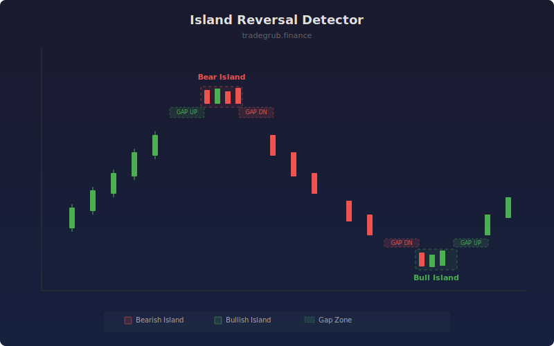

# Island Reversal Detector

Detects island reversal patterns where a cluster of bars becomes isolated by gaps on both sides. These patterns often signal strong reversals as the isolated price action represents trapped traders.

## How It Works

- Scans for gap-up or gap-down events using minimum gap percentage threshold
- Looks backward from each gap to find a matching opposite gap within the island length window
- Bullish islands: gap down into island, gap up out (bottom reversal)
- Bearish islands: gap up into island, gap down out (top reversal)
- Highlights the isolated zone with a colored box overlay

## Parameters

| Parameter | Default | Range | Description |
|-----------|---------|-------|-------------|
| Min Gap % | 0.5 | 0.1-5.0 | Minimum gap size as percentage of price |
| Max Island Bars | 5 | 2-20 | Maximum number of bars in the island cluster |
| Show Labels | true | - | Display pattern labels on chart |

## Outputs

- **Island Signal**: +1 for bullish island, -1 for bearish island, 0 otherwise
- **Box Overlay**: Green box for bullish, red box for bearish island zones
- **Labels**: Pattern identification at signal bars

## Usage Notes

- More common on daily charts where overnight gaps create clear isolation
- Reduce gap percentage for lower-volatility instruments
- Strongest signals occur with high volume on the exit gap
