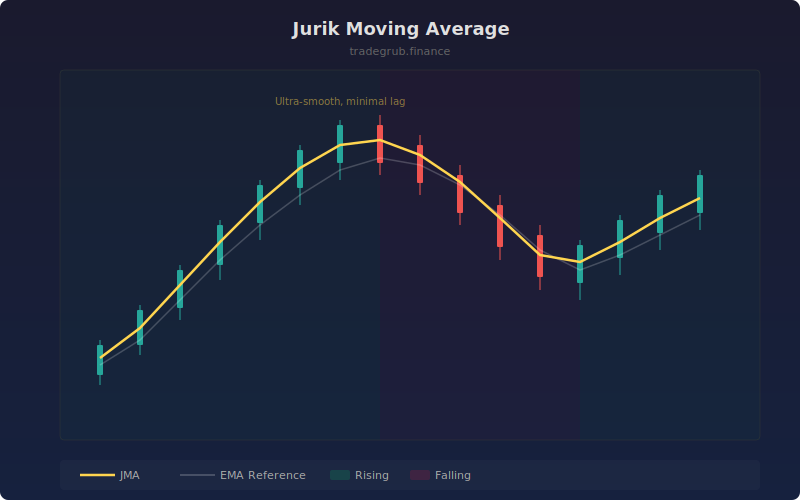

# Jurik Moving Average

Ultra-smooth low-lag moving average that uses adaptive smoothing with phase and power controls. It produces a remarkably clean line that responds quickly to genuine price changes while filtering out market noise, making it ideal for trend following and signal generation.

## How It Works

- Uses a three-stage adaptive filter with exponential smoothing controlled by beta and alpha parameters
- The phase parameter shifts the MA response curve, allowing fine-tuning between responsiveness and smoothness
- The power parameter controls the steepness of the adaptive decay
- Each stage progressively smooths the signal while preserving the error correction from previous stages
- The result is a line with significantly less lag than a standard EMA of the same effective period

## Parameters

| Parameter | Default | Range | Description |
|-----------|---------|-------|-------------|
| Length | 7 | 1-100 | Base smoothing period |
| Phase | 50 | -100-100 | Phase shift (-100 = smooth, 100 = responsive) |
| Power | 2.0 | 0.5-5.0 | Smoothing power factor |

## Outputs

- **JMA (gold)**: The Jurik moving average line
- **EMA Reference (faint white)**: Standard EMA for comparison
- **Background**: Green tint for rising, red tint for falling

## Usage Notes

- Phase values above 0 make the MA lead price slightly at the cost of potential overshoot
- Higher power values create more aggressive smoothing
- Excellent as a signal line when paired with another indicator for crossover systems
