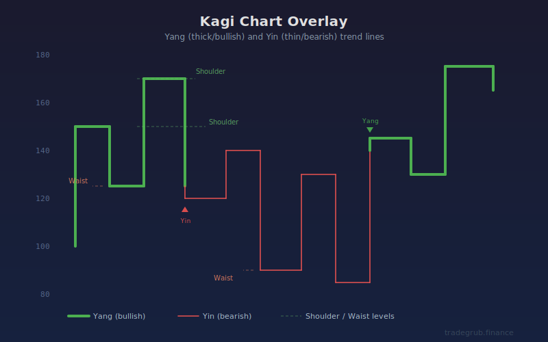

# Kagi Chart Overlay

A reversal-based trend indicator rooted in traditional Japanese charting. Kagi lines strip away time and focus purely on price movement, changing direction only when price reverses by a meaningful amount. The line thickness shifts between yang (thick, bullish) and yin (thin, bearish) when price breaks above prior shoulders or below prior waists.

## Conceptual Diagram

## How It Works

**Kagi Line Construction:** Unlike standard candlestick or line charts, Kagi charts ignore time intervals entirely. The line continues in its current direction as long as price keeps moving that way. A new vertical segment in the opposite direction only forms when price reverses by more than the configured reversal amount.

**Yang and Yin Lines:** When the Kagi line breaks above a prior shoulder (local high), it transitions to yang, drawn as a thick green line indicating bullish control. When it breaks below a prior waist (local low), it transitions to yin, drawn as a thin red line indicating bearish control.

**Shoulders and Waists:** Shoulders are the peaks where upward segments reverse downward. Waists are the troughs where downward segments reverse upward. These horizontal levels act as support and resistance. A break above a shoulder or below a waist signals a potential trend change.

**Reversal Amount:** The reversal threshold determines how much noise is filtered out. Larger reversals produce smoother lines that capture only major trend shifts. Smaller reversals show more detail but also more whipsaw.

## Parameters

| Parameter | Default | Range | Description |
|-----------|---------|-------|-------------|
| **Reversal Mode:** | ATR | ATR, Percent, Fixed | Method for calculating the reversal threshold |
| **Reversal %:** | 4.0 | 0.5 to 20.0 | Percentage of price used as reversal amount (Percent mode) |
| **Reversal Fixed:** | 1.0 | 0.01+ | Fixed dollar/point value for reversal (Fixed mode) |
| **ATR Length:** | 14 | 1 to 100 | Period for ATR calculation (ATR mode) |
| **ATR Multiplier:** | 1.5 | 0.1 to 5.0 | Multiplier applied to ATR for reversal threshold (ATR mode) |

## Signals

**Yang Transition (Bullish):** The line turns thick and green when price breaks above a prior shoulder level. This indicates buyers have overcome a previous resistance point, suggesting upward momentum.

**Yin Transition (Bearish):** The line turns thin and red when price breaks below a prior waist level. This indicates sellers have pushed through a previous support point, suggesting downward momentum.

**Shoulder Breaks:** Marked with upward triangle markers. A shoulder break confirms bullish strength and can serve as a buy signal, especially when confirmed by volume or other indicators.

**Waist Breaks:** Marked with downward triangle markers. A waist break confirms bearish weakness and can serve as a sell or exit signal.

**Background Shading:** Brief background color flashes highlight the exact bars where yang/yin transitions occur, making them easy to spot at a glance.

## When to Use

Kagi charts work best for identifying the dominant trend direction while filtering out minor price noise. They are particularly useful for:

- Swing trading where you want to hold positions through minor pullbacks
- Identifying trend reversals early through shoulder and waist breaks
- Markets that tend to trend strongly with periodic corrections
- Reducing false signals that appear on time-based charts during choppy conditions

Higher reversal amounts suit longer-term position trading. Lower reversal amounts suit shorter-term swing trading. The ATR mode automatically adapts the reversal threshold to current volatility, which is recommended for most users.

## Risk Management

- Wait for confirmed yang/yin transitions rather than anticipating them
- Use waist levels as natural stop-loss placement points during long positions
- Use shoulder levels as natural stop-loss placement points during short positions
- Kagi signals can lag during sharp V-shaped reversals; consider using alerts at key shoulder/waist levels
- In range-bound markets, the indicator may produce frequent yang/yin flips; reduce position size or stand aside during extended consolidation

## Combining With Other Indicators

- **Volume indicators:** Confirm shoulder/waist breaks with above-average volume for higher-confidence signals
- **RSI or Stochastic:** Filter yang transitions that occur at overbought levels, or yin transitions at oversold levels
- **Moving averages:** Use a long-term moving average as a trend filter; only take yang signals above the MA and yin signals below it
- **ATR-based stops:** Pair with ATR trailing stops to manage positions entered on yang/yin transitions
- **Support/resistance zones:** Shoulder and waist levels often align with horizontal support/resistance; confluence strengthens the signal
