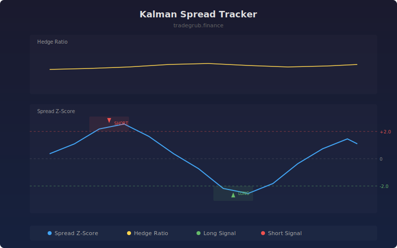

# Kalman Spread Tracker

Uses a Kalman filter to dynamically estimate the hedge ratio between price and its smoothed trend, then tracks the resulting spread for mean-reversion signals. The adaptive hedge ratio adjusts in real time, making it more responsive than static regression approaches.

## How It Works

- Applies a Kalman filter to estimate a time-varying hedge ratio between price and its moving average
- Computes the spread as the residual between price and the hedge-ratio-scaled reference
- Standardizes the spread into a z-score over a rolling window
- Generates long signals when the spread z-score drops below the negative threshold (undervalued)
- Generates short signals when the spread z-score rises above the positive threshold (overvalued)

## Parameters

| Parameter | Default | Range | Description |
|-----------|---------|-------|-------------|
| Process Noise (Q) | 0.01 | 0.001-0.1 | Kalman filter process noise controlling adaptation speed |
| Measurement Noise (R) | 1.0 | 0.1-10.0 | Kalman filter measurement noise controlling smoothness |
| Spread Z-Score Length | 20 | 5-100 | Rolling window for z-score calculation |
| Z-Score Threshold | 2.0 | 0.5-4.0 | Entry signal threshold for spread deviation |

## Outputs

- **Spread Z-Score**: Standardized spread deviation oscillator
- **Hedge Ratio**: Dynamic Kalman-estimated hedge ratio
- **Long/Short Spread**: Signal markers when z-score exceeds thresholds

## Usage Notes

- Lower process noise (Q) makes the hedge ratio more stable but slower to adapt
- Higher measurement noise (R) produces smoother estimates but may lag structural changes
- Best applied to instruments with a mean-reverting relationship to their trend
