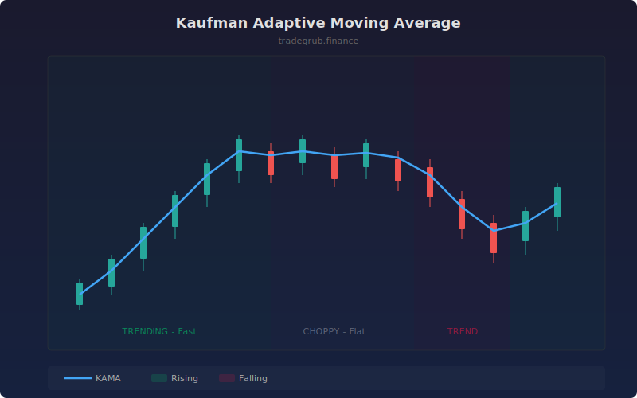

# Kaufman Adaptive Moving Average

Adaptive moving average that automatically adjusts its smoothing speed based on the efficiency ratio of price movement. In strong trends it tracks price closely; in choppy sideways markets it flattens out to filter noise.

## How It Works

- Calculates the efficiency ratio as the net price change divided by the sum of absolute bar-to-bar changes over the lookback period
- Maps the efficiency ratio to a smoothing constant between fast and slow EMA speeds
- Squares the smoothing constant to create a more responsive adaptive factor
- Applies the adaptive smoothing recursively to produce the KAMA line
- Background shading indicates the current trend direction

## Parameters

| Parameter | Default | Range | Description |
|-----------|---------|-------|-------------|
| Length | 10 | 2-100 | Lookback period for efficiency ratio |
| Fast Period | 2 | 1-20 | Fastest EMA equivalent period |
| Slow Period | 30 | 10-100 | Slowest EMA equivalent period |

## Outputs

- **KAMA (blue)**: The adaptive moving average line on price
- **Background**: Green tint for rising KAMA, red tint for falling

## Usage Notes

- KAMA flattening in choppy markets helps avoid whipsaw entries that plague fixed-period MAs
- Price crossing above a rising KAMA is a stronger signal than crossing a flat one
- Compare against a standard SMA of the same length to see the adaptive benefit
