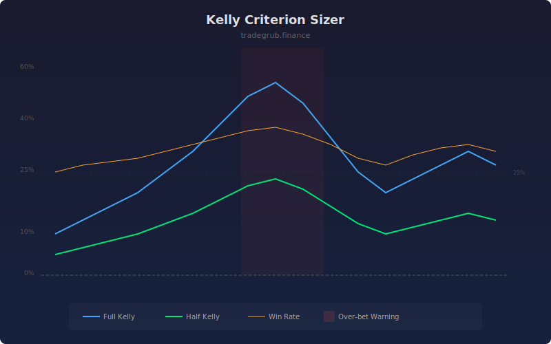

# Kelly Criterion Sizer

Calculates the mathematically optimal position size using the Kelly criterion, derived from rolling win rate and average payoff ratio. The Kelly formula maximizes long-term geometric growth rate while accounting for both the probability and magnitude of wins versus losses.

## How It Works

- Tracks bar-over-bar returns over a rolling lookback window as proxy trade results
- Calculates win rate (percentage of positive returns) and average win/loss magnitudes
- Applies the Kelly formula: K = W - (1-W)/R where W is win rate and R is payoff ratio
- Offers a fractional Kelly option for more conservative sizing
- Highlights periods where full Kelly exceeds 50% as potential over-betting risk

## Parameters

| Parameter | Default | Range | Description |
|-----------|---------|-------|-------------|
| Lookback Trades | 50 | 10-200 | Number of bars to use for win rate calculation |
| Kelly Fraction | 0.5 | 0.1-1.0 | Fraction of full Kelly to use (0.5 = half Kelly) |
| Min Kelly to Show | 0.0 | 0.0-0.5 | Minimum Kelly percentage to display |

## Outputs

- **Full Kelly %**: Blue line showing optimal position size as percentage of capital
- **Fractional Kelly %**: Green line showing conservative position size
- **Win Rate %**: Orange line showing rolling win rate
- **Over-bet Warning**: Red background when full Kelly exceeds 50%

## Usage Notes

- Most practitioners use half Kelly (0.5 fraction) to reduce variance while capturing most of the growth
- Rising Kelly percentage indicates improving edge conditions
- Full Kelly above 50% often signals unreliable estimates and warrants caution
