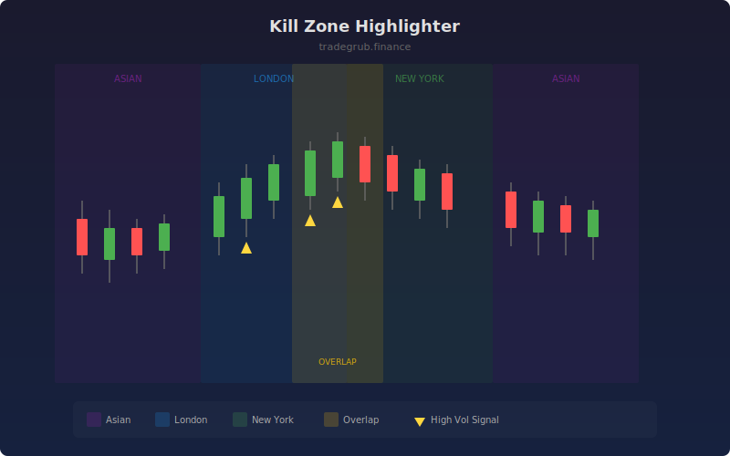

# Kill Zone Highlighter

Identifies and highlights the highest-probability trading windows based on major market session opens and overlaps. These "kill zones" correspond to periods of peak institutional activity and liquidity, helping traders focus on the most actionable parts of the trading day.

## How It Works

- Divides bar data into cyclical session blocks representing Asian, London, and New York sessions
- Highlights each session with a distinct background color for visual identification
- Detects London/New York overlap periods where liquidity and volatility peak
- Flags bars where volume exceeds the 20-period average by 20% during active kill zones
- Overlap zones receive a brighter highlight to draw attention to the highest-probability windows

## Parameters

| Parameter | Default | Range | Description |
|-----------|---------|-------|-------------|
| Show Asian Session | true | - | Toggle Asian session highlighting |
| Show London Open | true | - | Toggle London session highlighting |
| Show New York Open | true | - | Toggle New York session highlighting |
| Show London/NY Overlap | true | - | Toggle overlap zone highlighting |
| Session Length (bars) | 8 | 2-30 | Number of bars per session block |

## Outputs

- **Asian Zone**: Purple background shading
- **London Zone**: Blue background shading
- **New York Zone**: Green background shading
- **Overlap Zone**: Amber background shading (brighter)
- **High Vol Kill Zone**: Gold triangles marking high-volume bars within kill zones

## Usage Notes

- Adjust session length to match your chart timeframe and market structure
- The overlap zone typically offers the tightest spreads and strongest directional moves
- Gold triangle markers highlight the most active bars within kill zones for entry timing
