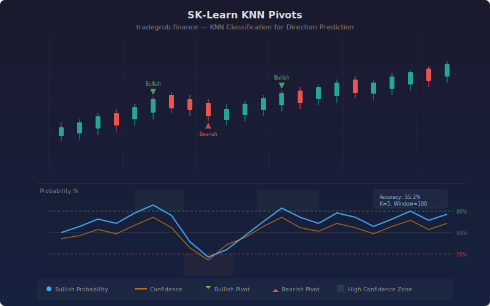

# KNN Pivot Prediction

Uses scikit-learn K-Nearest Neighbors classification to predict next-bar price direction based on rolling market features. The indicator trains a KNN model on a sliding window of historical data, computing bullish probability and confidence scores to identify high-conviction pivot points.

## Conceptual Diagram



## How It Works

The indicator engineers four features at each bar: returns over the lookback period, rolling price volatility, volume ratio (current volume vs. its moving average), and momentum (position within the recent high-low range). These features capture the essential characteristics of each bar's market context.

At each bar, a KNeighborsClassifier is trained on the previous N bars using these features, with labels derived from whether the following bar closed higher or lower. The trained model then predicts the current bar's next-bar direction, outputting both a class prediction and a probability estimate.

The bullish probability (0-100%) shows how likely the next bar is to close higher. The confidence score measures how far the probability deviates from 50% (pure uncertainty). Signals fire when probability crosses the configurable confidence bands, indicating high-conviction directional pivots.

## Parameters

| Parameter | Default | Range | Description |
| --------- | ------- | ----- | ----------- |
| K Neighbors | 5 | 3-20 | Number of nearest neighbors for classification |
| Feature Lookback | 10 | 3-50 | Window for computing features (returns, volatility) |
| Training Window | 100 | 50-500 | Number of historical bars used to train the model |
| Probability Smoothing | 3 | 1-10 | Moving average applied to raw probability output |
| Confidence Band Width | 0.3 | 0.05-0.5 | Distance from 50% to trigger pivot signals |
| Show Labels | true | -- | Toggle pivot point annotations |
| Show Levels | true | -- | Toggle accuracy statistics display |

## Outputs

- **Bullish Probability %:** Smoothed probability of next-bar upward close (0-100%)
- **Confidence %:** How decisive the prediction is (0-100%)
- **Upper/Lower Confidence Bands:** Thresholds for bullish/bearish pivot signals
- **Background shading:** Green for bullish zones, red for bearish zones
- **Accuracy label:** Rolling hit rate on high-confidence predictions

## Python Advantage

Scikit-learn provides the full KNN classification pipeline, including probability calibration and feature scaling:

```python
from sklearn.neighbors import KNeighborsClassifier
from sklearn.preprocessing import StandardScaler

knn = KNeighborsClassifier(n_neighbors=5)
knn.fit(X_scaled, y_train)
proba = knn.predict_proba(x_current)
```

The model adapts to changing market conditions through its rolling training window, continuously refitting on the most recent data.

## Usage Notes

- KNN predictions are not guarantees: accuracy typically ranges from 52-58% on financial data
- Higher K values produce smoother but less responsive predictions
- Wider confidence bands filter noise but generate fewer signals
- Works on any timeframe, but daily and 4-hour charts tend to have more stable feature distributions
- Combine with trend filters to avoid counter-trend KNN signals in strong directional markets
