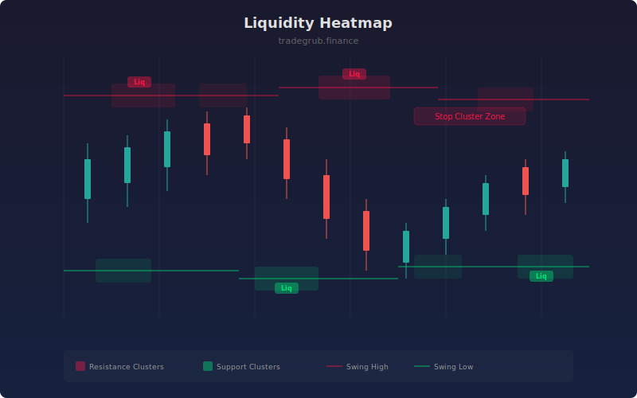

# Liquidity Heatmap

Maps estimated stop-loss and liquidation clusters across price levels based on swing structure. The indicator identifies where traders are likely placing stops around swing highs and lows, then visualizes the density of these clusters as a heatmap overlay.

## How It Works

- Scans for swing highs and swing lows using a configurable lookback window.
- Counts the number of swing points clustered near the current price within an ATR-scaled width.
- Normalizes cluster density to highlight zones with the highest concentration of estimated stops.
- Shades the background when cluster density exceeds 60% of the observed maximum.
- Plots step-line levels at the rolling swing high and swing low for visual reference.

## Parameters

| Parameter | Default | Range | Description |
|-----------|---------|-------|-------------|
| Swing Lookback | 10 | 3-50 | Bars used to identify swing highs and lows |
| Number of Levels | 8 | 3-20 | Grid resolution for level clustering |
| Zone Width (ATR) | 0.5 | 0.1-2.0 | Width of each cluster zone as a multiple of ATR |
| Cluster Lookback | 100 | 20-200 | How many bars back to scan for swing points |
| Show Labels | true | on/off | Display labels at high-density cluster zones |

## Outputs

- **Resistance Level**: Step-line at the rolling swing high
- **Support Level**: Step-line at the rolling swing low
- **Background shading**: Red tint for upper liquidity clusters, green tint for lower clusters
- **Labels**: "Liq" markers at the strongest cluster zones

## Usage Notes

- Higher cluster density zones are more likely to attract price as market makers target stop clusters.
- Use alongside order flow or volume indicators to confirm whether liquidity pools are being swept.
- Increase Cluster Lookback on higher timeframes to capture more structural context.
