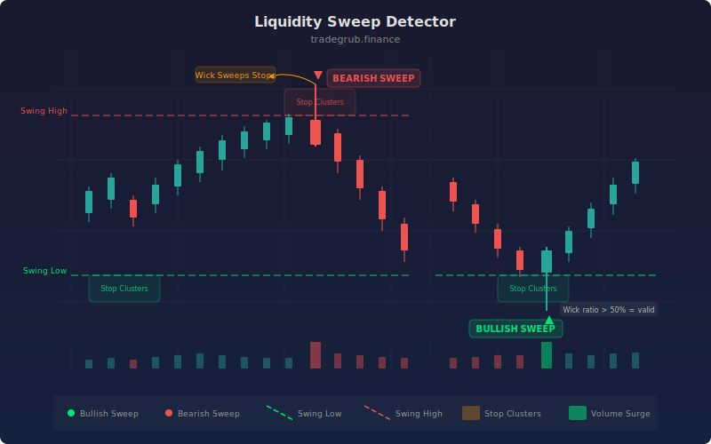

# Liquidity Sweep Detector

Detects price sweeps beyond recent swing highs and lows where clusters of stop orders typically rest. These sweeps often precede sharp reversals as institutional participants trigger stops to fill large orders before driving price in the opposite direction.

## Conceptual Diagram



## How It Works

The indicator calculates rolling swing highs and lows over a configurable lookback period. When price extends beyond these levels by a minimum ATR-based threshold but closes back inside, a sweep is detected. This pattern suggests that stop orders resting beyond the swing level were triggered before price reversed.

A wick ratio filter ensures that only candles with meaningful rejection wicks qualify as sweeps. For a bullish sweep (below support), the lower wick must exceed the configured ratio of the total candle range. For a bearish sweep (above resistance), the upper wick must meet the same threshold.

Confirmed sweeps are marked with directional arrows and optional background highlighting. The indicator also plots the current swing high and swing low levels as step lines, giving a clear view of where liquidity is likely pooling.

## Parameters

| Name | Default | Range | Description |
|------|---------|-------|-------------|
| Swing Lookback | 10 | 5 - 50 | Number of bars used to calculate swing highs and lows |
| ATR Length | 14 | 5 - 50 | Period for ATR calculation used in the sweep threshold |
| Sweep Threshold (ATR) | 0.1 | 0.01 - 1.0 | Minimum distance beyond the swing level (as ATR multiple) to qualify as a sweep |
| Min Wick Ratio | 0.5 | 0.1 - 1.0 | Minimum wick length relative to total candle range for rejection confirmation |
| Show Liquidity Zones | True | on/off | Display swing high and swing low step lines |
| Show Sweep Labels | True | on/off | Display triangle markers at sweep locations |
| Bullish Sweep | #00e676 | color | Color for bullish sweep markers and zones |
| Bearish Sweep | #ff1744 | color | Color for bearish sweep markers and zones |

## Python Advantage

Vectorized numpy operations make sweep detection fast across the entire dataset without per-bar loops:

```python
high_sweep = (high > prev_swing_high + threshold) & (close < prev_swing_high)
low_sweep = (low < prev_swing_low - threshold) & (close > prev_swing_low)

bear_wick_valid = upper_wick / total_range >= min_wick_ratio
bull_wick_valid = lower_wick / total_range >= min_wick_ratio

bearish_sweep = high_sweep & bear_wick_valid
bullish_sweep = low_sweep & bull_wick_valid
```

## When to Use

Liquidity sweeps are most effective on higher timeframes (1H and above) where swing levels have had time to accumulate stop orders. Look for sweeps at key daily or weekly levels, around round numbers, and near prior consolidation zones. The indicator works well in ranging markets where price oscillates between established highs and lows, and also catches the final exhaustion move before trend reversals.

## Risk Management

A sweep signal alone is not an entry trigger. Wait for confirmation from price action on lower timeframes before committing capital. Use the swept level as a reference for stop placement: if price closes decisively beyond the sweep level after the signal, the thesis is invalidated. Position size according to the distance between entry and the invalidation level.

## Combining with Other Indicators

- **Volume Profile or VWAP:** Confirm that the sweep occurred at a high-volume node or near VWAP, adding weight to the reversal signal.
- **RSI or Stochastic divergence:** A sweep paired with momentum divergence provides stronger evidence that the move beyond the swing level was a false breakout.
- **Order flow or delta indicators:** Check whether aggressive buying or selling absorbed the sweep, confirming that institutional participants are defending the level.
