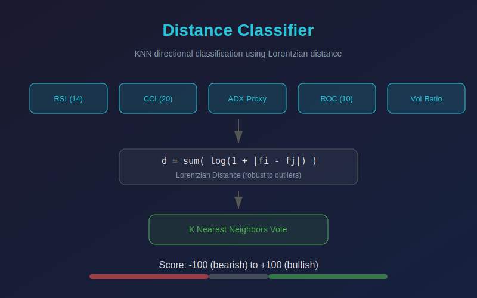

# Distance Classifier

KNN-based directional classifier using Lorentzian distance. Computes five features per bar (RSI, CCI, ADX proxy, ROC, volatility ratio), normalizes them, and finds the K nearest neighbors within a rolling lookback window. Each neighbor votes on direction based on what happened on the following bar. The output is a classification score from -100 (bearish) to +100 (bullish).

## Conceptual Diagram

## Parameters

- **Lookback:** Number of historical bars to search for neighbors (default 100)
- **Neighbors:** Number of nearest neighbors used for voting (default 8)

## Features

1. **RSI (14):** Relative strength index measuring momentum
2. **CCI (20):** Commodity channel index measuring deviation from mean
3. **ADX Proxy (14):** Directional movement ratio approximating trend strength
4. **ROC (10):** Rate of change as percent difference over 10 bars
5. **Volatility Ratio:** ATR divided by close, scaled to percentage

## Signals

- **Score above +50:** Strong bullish consensus among nearest neighbors (green background)
- **Score below -50:** Strong bearish consensus among nearest neighbors (red background)
- **Score near 0:** Mixed or neutral signal, no dominant direction

## Usage

Apply to any timeframe. Shorter lookback windows react faster but may overfit to noise. Larger neighbor counts produce smoother, more stable readings. Combine with trend filters or volume confirmation for higher-quality entries.
