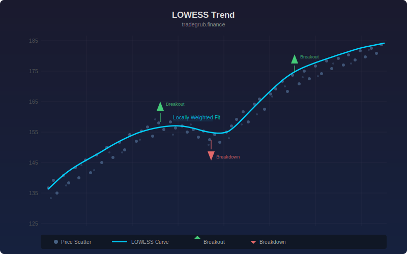

# LOWESS Trend

Locally Weighted Scatterplot Smoothing applied to price data. Fits a weighted linear regression at each point using tricube kernel weights, producing a smooth adaptive trend line.

## Conceptual Diagram

## Parameters

| Parameter | Type | Default | Range | Description |
|-----------|------|---------|-------|-------------|
| Bandwidth | int | 20 | 5-100 | Half-window size for local regression |

## Signals

- Green line: price is above the LOWESS trend (bullish)
- Red line: price is below the LOWESS trend (bearish)
- Triangle up: price crosses above the trend line (breakout)
- Triangle down: price crosses below the trend line (breakdown)

## Usage

LOWESS adapts to local price structure without assuming a fixed functional form. Wider bandwidth produces smoother trends, narrower bandwidth tracks price more closely. Use crossovers as trend-change signals and the line slope for directional bias.
