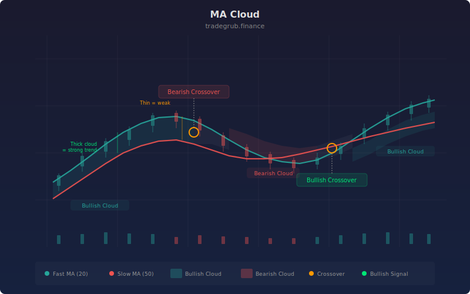

# MA Cloud

The MA Cloud plots two moving averages with a dynamically colored fill between them, creating an "Ichimoku-style" cloud that instantly communicates trend direction and strength. The cloud turns green when the fast MA leads above the slow MA and red when the relationship inverts. Adapted from the Kumo cloud concept developed by Goichi Hosoda in the 1960s, this simplified version distills trend identification into a single visual element that works as both an overlay and a background context layer.

## Conceptual Diagram



## How It Works

The indicator calculates two moving averages of the close price using the user-selected type (SMA or EMA) and periods. The fast MA (default 20) responds more quickly to price changes, while the slow MA (default 50) provides a smoother baseline. Their relative position defines the trend state.

When the fast MA is above the slow MA, the area between them is filled with a green translucent color, creating a bullish cloud. When the fast MA drops below the slow MA, the fill switches to red, indicating bearish conditions. The transition points where the MAs cross are the trend change signals.

The cloud's thickness carries information about trend strength. A thick cloud means the fast and slow MAs are far apart, indicating strong momentum separation. A thin cloud suggests the MAs are converging and a crossover (trend change) may be approaching. The thinnest point of the cloud, just before a color change, often corresponds to the lowest-conviction period.

The dynamic color switching uses numpy's `np.where` function to evaluate the bullish condition across all bars simultaneously and assign the appropriate fill color to each bar, producing seamless color transitions at exact crossover points without any per-bar conditional logic.

## Parameters

| Parameter | Default | Range | Description |
|-----------|---------|-------|-------------|
| Fast MA Length | 20 | 1 - 200 | Period for the fast moving average |
| Slow MA Length | 50 | 2 - 500 | Period for the slow moving average |
| MA Type | SMA | SMA, EMA | Moving average calculation method |

## Python Advantage

The dynamic cloud coloring uses numpy's conditional array selection, applying different colors across the entire series in a single vectorized operation:

```python
# Conditional MA type selection at runtime
if ma_type == "SMA":
    fast_ma = ta.sma(close, fast_len)
    slow_ma = ta.sma(close, slow_len)
else:
    fast_ma = ta.ema(close, fast_len)
    slow_ma = ta.ema(close, slow_len)

# Vectorized boolean comparison across all bars
bullish = fast_ma > slow_ma

# np.where assigns fill color per-bar in one operation — no loop
fill_color = np.where(bullish, "rgba(38,166,154,0.15)", "rgba(239,83,80,0.15)")
fill(p1, p2, color=fill_color)
```

The `np.where` call evaluates the bullish condition for every bar and returns the appropriate color string in a single vectorized pass. You could chain multiple `np.where` calls or use `np.select` for multi-regime coloring (e.g., strong bullish, weak bullish, neutral, weak bearish, strong bearish) based on the magnitude of `fast_ma - slow_ma`. Pine's ternary expressions cannot scale to multi-condition logic this cleanly.

## When to Use

The MA Cloud works on all timeframes and all liquid instruments. It is most effective as a background trend context layer on daily and 4-hour charts. Use it to establish directional bias before applying shorter-term entry signals. The cloud is particularly valuable for traders who want a clean, uncluttered chart with immediate trend visibility.

## Risk Management

Do not trade crossovers blindly. The cloud transition itself is the signal, but entries should be confirmed with price action or a momentum indicator. During choppy markets, the MAs will cross frequently, producing thin alternating clouds. In these conditions, widen stops or step aside entirely. Place stops beyond the slow MA when trading with the cloud direction.

## Combining with Other Indicators

- **MA Crossover Signal**: Layer the crossover arrows on top of the MA Cloud to get both the visual context and precise signal markers in one view.
- **Volatility Regime**: Use the Volatility Regime indicator to filter cloud signals. Crossovers during low-volatility compression regimes tend to produce the strongest follow-through moves.
- **Momentum Composite**: Confirm cloud direction changes with the Momentum Composite to avoid acting on false crossovers in choppy markets.
