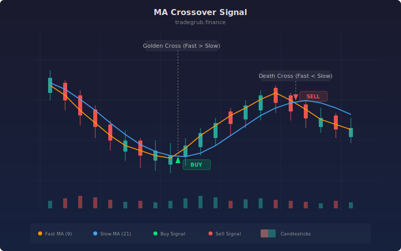

# MA Crossover Signal

The Moving Average Crossover Signal is one of the most foundational trend-following systems in technical analysis, dating back to Richard Donchian's work in the 1960s. This implementation plots a fast and slow moving average with automatic triangle markers at every crossover point. It supports four MA types (SMA, EMA, WMA, HMA), giving traders flexibility to match the crossover sensitivity to their trading style and timeframe.

## Conceptual Diagram



## How It Works

The indicator calculates two moving averages of the close price using the selected MA type and periods. The fast MA (default 9) tracks recent price action more closely, while the slow MA (default 21) represents the longer-term trend baseline. When the fast MA crosses above the slow MA, it generates a bullish signal. When it crosses below, a bearish signal is produced.

Four moving average types are available. SMA (Simple Moving Average) weights all bars equally and produces the smoothest crossover signals with the most lag. EMA (Exponential Moving Average) gives more weight to recent bars, producing faster but noisier signals. WMA (Weighted Moving Average) applies linearly increasing weights for a balance between responsiveness and smoothness. HMA (Hull Moving Average) uses a weighted combination of WMAs to reduce lag while maintaining smoothness, making it the most responsive option.

The crossover detection uses `ta.crossover` and `ta.crossunder` functions that identify the exact bar where the fast MA transitions from below to above (or above to below) the slow MA. These single-bar events are rendered as triangle shapes: green up-triangles below bars for bullish crosses and red down-triangles above bars for bearish crosses.

The choice of MA type and period lengths fundamentally changes the system's character. Short periods (e.g., 5/13 EMA) produce frequent signals suited for active trading. Longer periods (e.g., 50/200 SMA) produce the classic "golden cross" and "death cross" signals used by institutional investors for major trend changes.

## Parameters

| Parameter | Default | Range | Description |
|-----------|---------|-------|-------------|
| Fast MA Length | 9 | 1 - 100 | Period for the fast moving average |
| Slow MA Length | 21 | 2 - 300 | Period for the slow moving average |
| MA Type | EMA | SMA, EMA, WMA, HMA | Moving average calculation method |

## Python Advantage

Python's conditional branching selects the MA type at runtime, computing full arrays for the chosen type. The crossover detection and shape plotting operate on complete boolean arrays:

```python
# Runtime MA type selection — four types, full array per choice
if ma_type == "EMA":
    fast_ma = ta.ema(close, fast_len)
    slow_ma = ta.ema(close, slow_len)
elif ma_type == "HMA":
    fast_ma = ta.hma(close, fast_len)
    slow_ma = ta.hma(close, slow_len)

# Crossover detection as boolean array operations
cross_up = ta.crossover(fast_ma, slow_ma)
cross_down = ta.crossunder(fast_ma, slow_ma)

# Shape plotting uses boolean arrays directly — no bar-by-bar loop
plotshape(cross_up, style="triangleup", location="belowbar", color="green")
plotshape(cross_down, style="triangledown", location="abovebar", color="red")
```

The four-way MA type selection is clean conditional logic. Python's advantage emerges when extending the system: you could dynamically iterate over all four types with `[ta.ema, ta.sma, ta.wma, ta.hma]`, compare their crossover timing arrays, and select the consensus signal using `np.sum([cross_up_ema, cross_up_sma, cross_up_wma], axis=0) >= 2` for majority-vote filtering.

## When to Use

MA Crossover signals work best in trending markets on daily, 4-hour, and 1-hour charts. They are effective on equities, ETFs, futures, and forex. Use shorter periods for active/day trading and longer periods for swing and position trading. Avoid using crossover signals in confirmed ranging markets where the MAs will whipsaw repeatedly, generating losses on every false cross.

## Risk Management

Place stops below the most recent swing low for bullish crosses and above the most recent swing high for bearish crosses. Alternatively, use the slow MA itself as a trailing stop. Be aware that all crossover systems are inherently lagging: the signal occurs after the trend has already begun, so some of the move will always be missed. The HMA type reduces this lag but increases sensitivity to noise.

## Combining with Other Indicators

- **MA Cloud**: Layer the MA Cloud underneath the crossover signals to see both the discrete signal events and the continuous trend state simultaneously.
- **Market Regime**: Only act on crossover signals when the Market Regime detector confirms a trending environment, filtering out whipsaws during ranging periods.
- **Volume Profile POC**: Validate crossover signals that occur near the Point of Control, where high volume participation increases the likelihood of follow-through.
