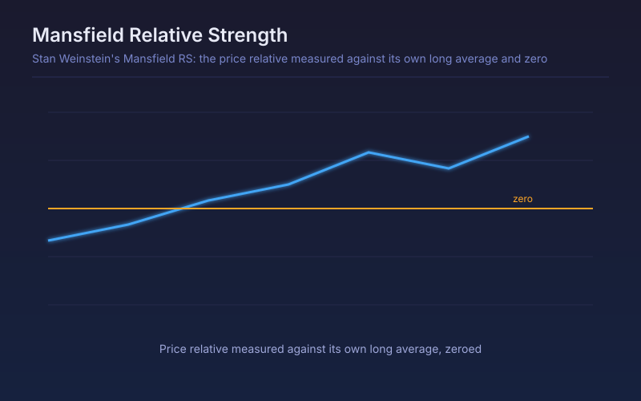

# Mansfield Relative Strength

Stan Weinstein's Mansfield RS: the price relative measured against its own long average and zeroed, so the line crossing zero marks the start of relative leadership.

## Conceptual Diagram

## Parameters

| Parameter | Default | Range | Description |
|-----------|---------|-------|-------------|
| Benchmark symbol | SPY | any symbol | Index the ratio is measured against, usually a broad market proxy |
| Zero-line MA length | 52 | 10-300 | Average of the price relative that defines the zero line; 52 on weekly bars is Weinstein's original |
| Scale | 10.0 | 1-100 | Cosmetic multiplier on the plotted value |

## Signals

- Crossing above zero: the symbol has started outperforming its own recent relative trend, the Stage 2 confirmation in Weinstein's method
- Holding above zero while price breaks out: leadership confirmed by relative strength
- Crossing below zero: relative leadership lost even if absolute price is still rising
- Deeply negative and flat: a laggard, the Stage 4 profile

## Usage

Use as the relative-strength half of stage analysis: a breakout with Mansfield RS below zero is a breakout the market as a whole is doing better than. Originally defined on weekly bars with a 52-period average.
