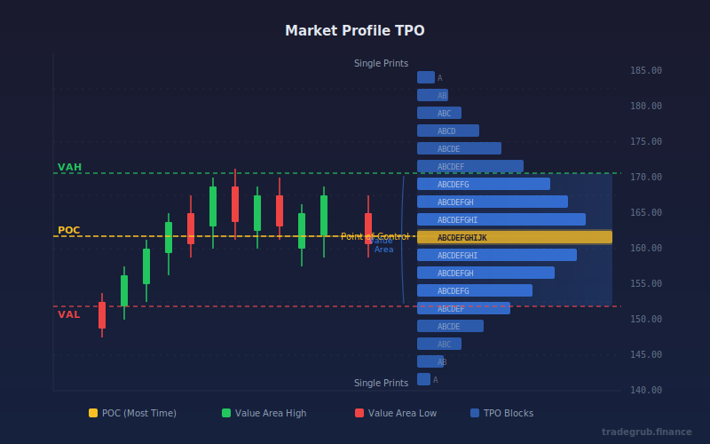

# Market Profile TPO

Time Price Opportunity (TPO) analysis that reveals how much time price spends at each level, identifying value areas, the Point of Control, and single prints where price moved quickly.

## Conceptual Diagram



## How It Works

Market Profile organizes price data by time spent at each level rather than by volume. The core idea is that price acceptance shows where the market finds fair value, while price rejection reveals levels the market considers unfair.

**Time-based profiling** counts how many bars (time periods) had their high-low range touching a given price level. Each bar that touches a price bin adds one TPO to that level. Over a lookback window, this builds a horizontal histogram showing the distribution of time across price.

This differs from volume-based profiling, which weights each level by the number of shares or contracts traded there. TPO profiling gives equal weight to every time period, making it useful for markets where volume data is unavailable or unreliable, and for understanding the temporal structure of price acceptance.

The indicator divides the price range over the lookback period into a configurable number of bins. For each bar in the lookback window, it increments every bin that falls within that bar's high-low range. The result is a distribution that typically forms a bell-curve shape, with the most time concentrated around a central fair value.

**Point of Control (POC):** The price level (bin) with the highest TPO count. This is where price spent the most time and represents the level of greatest acceptance.

**Value Area:** Starting from the POC, the indicator expands outward (up and down) adding the next-largest adjacent TPO counts until the specified percentage of total time is captured. The top of this range is the Value Area High (VAH) and the bottom is the Value Area Low (VAL).

## Parameters

| Parameter | Default | Range | Description |
|-----------|---------|-------|-------------|
| Number of Bins | 30 | 10-100 | Price levels to divide the range into. More bins give finer resolution |
| Lookback Period | 50 | 10-200 | Number of bars to analyze for building the profile |
| Value Area % | 70 | 50-90 | Percentage of total time that defines the value area |
| Show POC | true | bool | Display the Point of Control line |
| Show Value Area | true | bool | Display VAH, VAL lines and shading |

## Signals

**Point of Control (POC):** The yellow line marks the price where the most time was spent. Price tends to gravitate back toward the POC. A break away from POC with conviction can signal a trend move.

**Value Area High (VAH):** The upper boundary of the value area. Price trading above VAH suggests bullish sentiment, with the market accepting higher prices. VAH often acts as support once broken above.

**Value Area Low (VAL):** The lower boundary of the value area. Price trading below VAL suggests bearish sentiment. VAL often acts as resistance once broken below.

**Single Prints:** Price levels with very low TPO counts (1 or 2) indicate areas where price moved quickly. These levels often get revisited later as the market fills in the profile.

**Value Area Rotation:** When price opens inside the value area, expect range-bound trading. When price opens outside the value area, watch for either a move back into value (failed breakout) or a sustained move away (trend day).

## Python Advantage

NumPy enables efficient histogram computation across the full lookback window:

```python
# Build TPO count: how many bars touched each bin
tpo_counts = np.zeros(num_bins, dtype=int)
for i in range(lookback):
    first_bin = int((l[i] - range_low) / bin_size)
    last_bin = int((h[i] - range_low) / bin_size)
    tpo_counts[first_bin:last_bin + 1] += 1

# POC: bin with the highest TPO count
poc_idx = int(np.argmax(tpo_counts))
```

Python's array slicing and NumPy operations make the bin-counting and value area expansion logic concise and readable compared to loop-heavy alternatives.

## When to Use

- **Intraday trading:** Identify fair value zones for mean-reversion entries
- **Swing trading:** Find key support/resistance levels based on time-at-price
- **Pre-market analysis:** Determine the prior session's value area to anticipate breakout or rotation scenarios
- **Auction theory:** Understand whether the market is in balance (rotating inside value) or imbalance (trending away from value)
- **Gap analysis:** When price gaps above VAH or below VAL, assess the probability of gap fill by comparing to historical value area behavior

## Risk Management

- POC and value area levels are not guaranteed support/resistance. Always use stop losses.
- The indicator recalculates each bar, so levels shift as new data arrives. Avoid anchoring to stale levels.
- In strong trends, the value area will lag price. Do not fade a trend solely because price is outside the value area.
- Combine with volume confirmation. A break from the value area on high volume is more meaningful than one on low volume.
- Wider bin settings smooth the profile but reduce precision. Narrower bins add noise. Adjust based on the asset's typical range.

## Combining With Other Indicators

- **VWAP:** Compare TPO-based POC with VWAP. When they converge, it confirms a strong fair value level. Divergence suggests the volume-weighted and time-weighted perspectives disagree.
- **Volume Profile:** Use alongside volume-based profiles for a complete picture. TPO shows time acceptance; volume profile shows capital commitment.
- **RSI or Stochastic:** When price is at VAH with overbought readings, consider taking profits. When at VAL with oversold readings, look for long entries.
- **Moving Averages:** A value area aligned with a key moving average (such as the 20 or 50 period) creates a stronger support/resistance zone.
- **ATR:** Use Average True Range to gauge whether the current value area width is normal for the asset. An unusually narrow value area often precedes a breakout.
