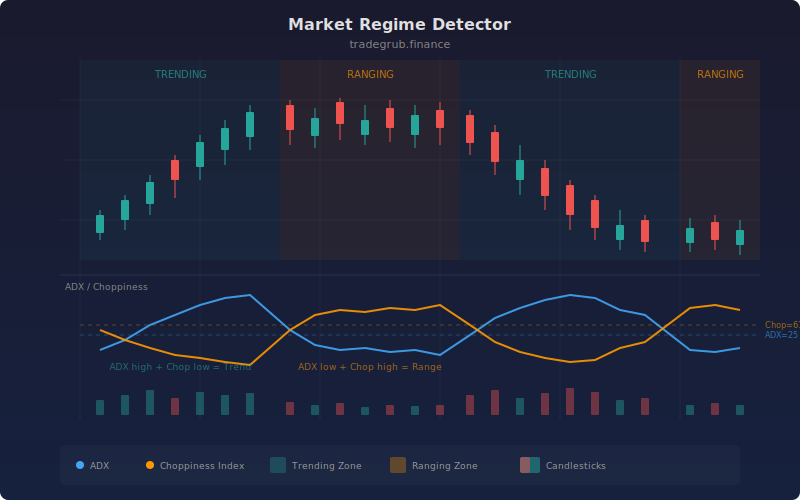

# Market Regime Detector

The Market Regime Detector combines the Average Directional Index (ADX) and Choppiness Index to classify the market into trending or ranging states with colored background highlighting. Developed from Wilder's ADX (1978) and the Choppiness Index introduced by Bill Dreiss, this dual-indicator approach provides more reliable regime classification than either metric alone, helping traders select the right strategy for current conditions.

## Conceptual Diagram



## How It Works

The detector uses two complementary indicators to classify market state. ADX measures trend strength on a 0-100 scale where higher values indicate stronger directional movement, regardless of direction. The Choppiness Index measures market disorder on a 0-100 scale where higher values indicate choppier, more range-bound price action.

The classification logic requires both indicators to agree. A trending regime is identified when ADX is above its threshold (default 25) AND Choppiness is below its threshold (default 61.8). This dual confirmation ensures that the market is both directionally strong and not exhibiting choppy behavior. The green background shading highlights these trending periods.

A ranging regime is identified when the conditions invert: ADX below its threshold AND Choppiness above its threshold. This confirms that the market lacks directional momentum and is exhibiting disorderly price movement. Orange background shading highlights these ranging periods.

When the indicators give mixed signals (e.g., moderate ADX with moderate Choppiness), the market is in an ambiguous state and receives no background highlighting. These transition zones are often the most dangerous for trading, as neither trend-following nor mean-reversion strategies have a clear edge.

The indicator also computes a regime score using numpy: +1 for trending, -1 for ranging, and 0 for ambiguous states, which can be used programmatically for strategy selection.

## Parameters

| Parameter | Default | Range | Description |
|-----------|---------|-------|-------------|
| ADX Length | 14 | 5 - 50 | Lookback period for the ADX calculation |
| Choppiness Length | 14 | 5 - 50 | Lookback period for the Choppiness Index |
| Trend Threshold | 25 | 15 - 40 | ADX level above which the market is considered trending |
| Chop Threshold | 61.8 | 50.0 - 75.0 | Choppiness level above which the market is considered ranging |

## Python Advantage

The regime classification uses numpy's vectorized conditional logic to produce boolean arrays and a numeric regime score across all bars in a single pass:

```python
import numpy as np

# Vectorized boolean arrays for regime classification
trending = (adx_val > trend_thresh) & (chop_val < chop_thresh)
ranging = (adx_val < trend_thresh) & (chop_val > chop_thresh)

# np.where produces numeric regime score — no loop needed
regime_score = np.where(trending, 1, np.where(ranging, -1, 0))

# Background shading via boolean array masking
bgcolor(trending, color="rgba(38,166,154,0.08)")
bgcolor(ranging, color="rgba(255,152,0,0.08)")
```

The `&` operator performs element-wise AND across full numpy arrays, and nested `np.where` calls create multi-state classification in one expression. This pattern scales to any number of regime states. You could add `np.where(regime_score[:-1] != regime_score[1:], True, False)` to detect regime transitions as a boolean array, something that would require explicit state tracking in Pine.

## When to Use

The Market Regime Detector works on all timeframes and asset classes. It is most valuable on daily and 4-hour charts as a strategy selection filter. Apply trend-following strategies (MA crossovers, breakouts) during trending regimes and mean-reversion strategies (bands, oscillators) during ranging regimes. Regime transitions often signal the best entry opportunities.

## Risk Management

During ambiguous regimes (no background highlighting), reduce position sizes or stay flat. Regime changes can happen quickly, so do not assume the current regime will persist. Use the regime score as a filter rather than a signal: it tells you which strategy type to apply, not when to enter or exit. Pair with a dedicated entry signal for timing.

## Combining with Other Indicators

- **MA Crossover Signal**: Only take crossover signals when the regime detector confirms a trending environment, dramatically reducing whipsaw losses.
- **Z-Score Indicator**: Apply z-score mean-reversion entries only during confirmed ranging regimes where price oscillation is the dominant pattern.
- **Volatility Regime**: Cross-reference market regime with volatility regime to distinguish between trending-volatile, trending-quiet, ranging-volatile, and ranging-quiet states for nuanced strategy selection.
