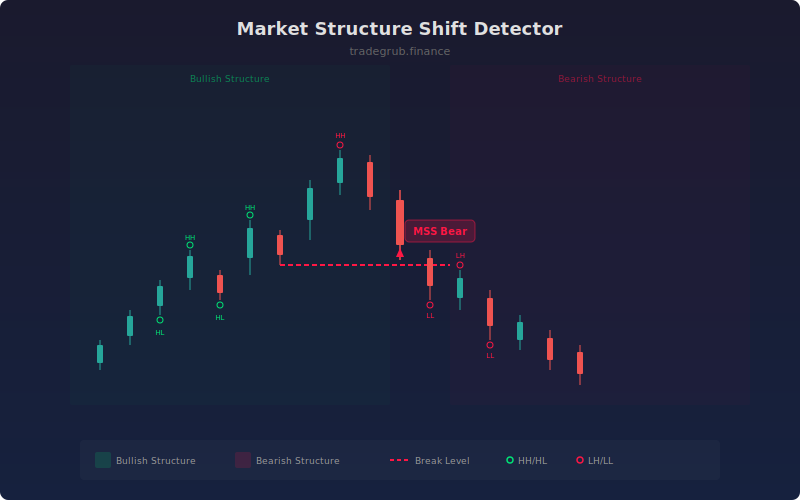

# Market Structure Shift Detector

Detects structural shifts from bullish to bearish or vice versa by analyzing the pattern of swing highs and swing lows. A market structure shift (MSS) occurs when the established sequence of higher highs and higher lows (or lower highs and lower lows) is broken, signaling a potential trend reversal.

## How It Works

- Identifies swing highs and swing lows using a configurable lookback window.
- Tracks whether swing points form higher highs/higher lows (bullish) or lower highs/lower lows (bearish).
- Flags a bullish MSS when structure transitions from bearish to bullish.
- Flags a bearish MSS when structure transitions from bullish to bearish.
- Draws dashed lines at the break level and shades background by current trend direction.

## Parameters

| Parameter | Default | Range | Description |
|-----------|---------|-------|-------------|
| Swing Length | 5 | 2-20 | Bars used to identify swing points |
| Show Labels | true | on/off | Display MSS labels at shift points |
| Show Structure Lines | true | on/off | Draw dashed lines at the break level |

## Outputs

- **Bullish MSS**: Green triangle and label when structure shifts bullish
- **Bearish MSS**: Red triangle and label when structure shifts bearish
- **Background**: Green tint during bullish structure, red tint during bearish
- **Structure Lines**: Dashed lines at the swing level where the break occurred

## Usage Notes

- MSS signals are most reliable when confirmed by displacement or volume.
- Use the trend background shading to quickly identify the current structural bias.
- Shorter swing lengths produce more signals but may include noise from minor swings.
