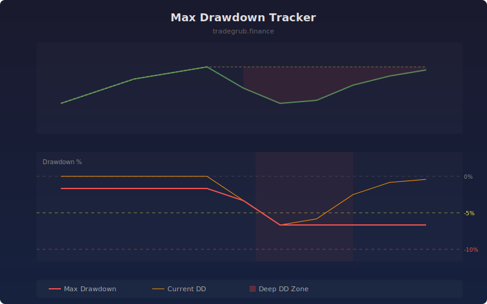

# Max Drawdown Tracker

The Max Drawdown Tracker monitors the worst peak-to-trough decline over a rolling window, providing real-time visibility into downside risk exposure. It displays both the current drawdown from the running high and the maximum drawdown within the lookback period, helping traders understand their worst-case loss scenarios.

## How It Works

- Tracks the running all-time high of the price series
- Calculates the current percentage decline from the running high
- Computes the maximum drawdown (worst decline) over the rolling window
- Counts consecutive bars spent in drawdown for duration analysis
- Highlights periods of deep drawdown with background shading

## Parameters

| Parameter | Default | Range | Description |
|-----------|---------|-------|-------------|
| Rolling Window | 50 | 10-500 | Lookback period for max drawdown calculation |
| Show Current Drawdown | true | - | Display current drawdown line |

## Outputs

- **Max Drawdown**: Worst drawdown in the rolling window (red line)
- **Current DD**: Current percentage below running high (orange line)
- **Background**: Red shading when drawdown exceeds 5%

## Usage Notes

- The max drawdown line only moves lower (more negative) within its window
- Watch for the current drawdown line approaching the max drawdown level
- Use reference lines at -5% and -10% as risk management thresholds
