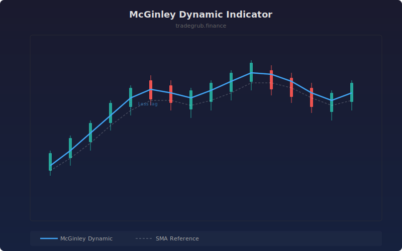

# McGinley Dynamic Indicator

Self-adjusting moving average that automatically speeds up in downtrends and slows during consolidation based on market velocity. It uses a fourth-power ratio of price to its previous value, making it naturally adaptive without requiring separate volatility calculations.

## How It Works

- Starts with an initial value equal to the first price
- Each bar adjusts by the difference between price and the previous value, divided by a dynamic denominator
- The denominator uses the price-to-MA ratio raised to the fourth power, creating non-linear speed adjustment
- When price moves quickly away from the MA, the denominator shrinks and the MA catches up faster
- A K factor controls the overall responsiveness of the adjustment

## Parameters

| Parameter | Default | Range | Description |
|-----------|---------|-------|-------------|
| Length | 14 | 2-200 | Base smoothing period |
| K Factor | 0.6 | 0.1-2.0 | Speed adjustment factor (lower = faster response) |

## Outputs

- **McGinley Dynamic (blue)**: The self-adjusting moving average
- **SMA Reference (faint white)**: Standard SMA for comparison
- **Background**: Green tint for rising, red tint for falling

## Usage Notes

- The McGinley Dynamic tends to hug price more closely than an SMA of the same length
- Lower K factor values make the indicator more responsive but potentially noisier
- Compare against the SMA reference to see where the dynamic adjustment provides an edge
