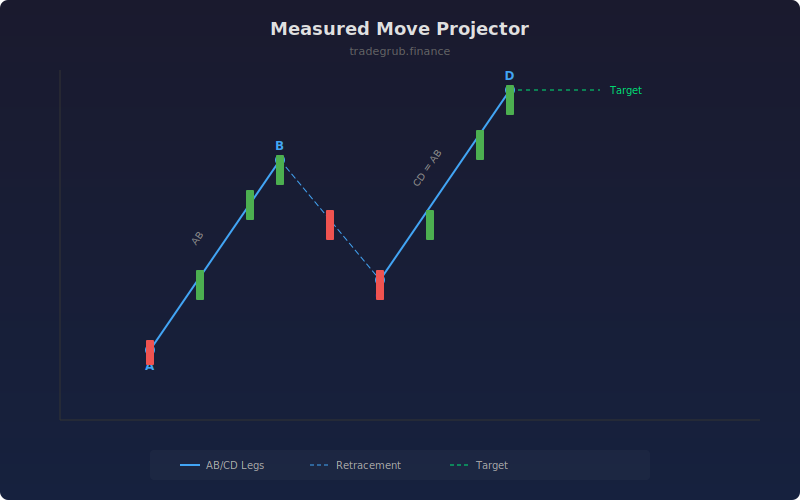

# Measured Move Projector

Projects price targets using the measured move (AB=CD) pattern where the second leg of a move is expected to equal the first. This geometric approach provides objective profit targets based on price symmetry.

## How It Works

- Identifies swing highs and lows using a configurable lookback period
- Scans consecutive ABCD swing sequences for both bullish and bearish patterns
- Validates that the CD leg length is within tolerance of the AB leg
- Draws the AB and CD legs with connecting retracement line
- Projects the target price at point D extended by the AB distance

## Parameters

| Parameter | Default | Range | Description |
|-----------|---------|-------|-------------|
| Swing Length | 10 | 3-50 | Lookback bars for swing detection |
| CD Tolerance % | 10.0 | 1.0-30.0 | How close CD must match AB length |
| Show Targets | true | - | Display projected target lines and labels |

## Outputs

- **MM Signal**: +1 for bullish measured move, -1 for bearish, 0 otherwise
- **Pattern Lines**: AB and CD legs drawn on chart with dashed connector
- **Target Labels**: Projected price target at completion

## Usage Notes

- Tighter tolerance finds more precise patterns but fewer occurrences
- Works best in trending markets where symmetrical moves repeat
- Combine with support/resistance levels for higher confidence targets
