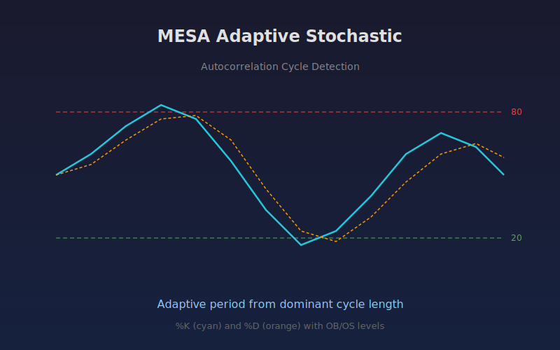

# MESA Adaptive Stochastic

Stochastic oscillator that adapts its lookback period using MESA autocorrelation cycle detection. Instead of a fixed period, the indicator estimates the dominant market cycle length and uses it as the stochastic window.

## Conceptual Diagram

## Parameters

- **Min Period:** Minimum allowed cycle period (default 5)
- **Max Period:** Maximum allowed cycle period (default 50)
- **D Smoothing:** SMA smoothing length for %D line (default 3)

## Signals

- **%K above 80:** Overbought zone, highlighted with red background
- **%K below 20:** Oversold zone, highlighted with green background
- **%K / %D crossover:** Potential reversal when %K crosses above or below %D

## Usage

Add this indicator to any chart as a lower panel oscillator. It works best on instruments with clear cyclical behavior. The adaptive period adjusts automatically to changing market conditions, reducing whipsaws compared to fixed-period stochastic.

Shorter Min Period values increase sensitivity. Wider Min/Max ranges allow the algorithm to detect a broader set of cycles but may introduce more variability.
