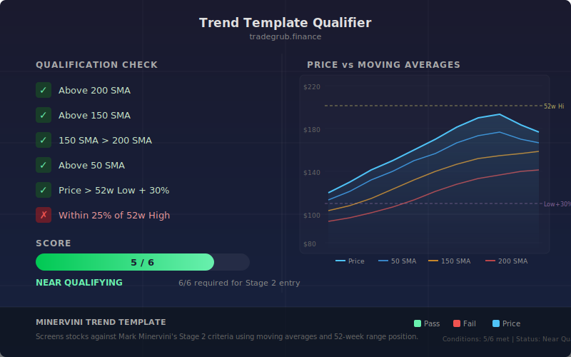

# Trend Template Qualifier

Scores a stock from 0 to 6 based on stage-2 trend template conditions. All six conditions must be met for a stock to qualify as a leading growth candidate. The score updates each bar so you can track how close a stock is to full qualification over time.

## Conceptual Diagram

## Parameters

This indicator uses fixed thresholds with no user-configurable inputs.

- **150-day SMA**: Short-term trend moving average
- **200-day SMA**: Long-term trend moving average
- **52-week window (252 bars)**: Used for rolling high, rolling low, and relative strength calculation
- **30% above 52-week low**: Minimum distance from the low to confirm upside momentum
- **25% of 52-week high**: Maximum distance from the high to confirm the stock is near its peak range
- **Relative strength > 0%**: Yearly return must be positive

## Conditions Checked

1. Price above 150-day SMA
2. Price above 200-day SMA
3. 150-day SMA above 200-day SMA
4. Price at least 30% above 52-week low
5. Price within 25% of 52-week high
6. Positive relative strength (yearly return > 0%)

## Signals

- **Score 6 (green background)**: All conditions met, stock qualifies
- **Score 4-5 (green bars)**: Most conditions met, close to qualifying
- **Score 2-3 (orange bars)**: Partial qualification
- **Score 0-1 (red bars)**: Does not qualify

## Usage

Look for stocks scoring a full 6 to identify candidates in confirmed stage-2 uptrends. Watch for the score rising from low values as potential early entries before full qualification.
