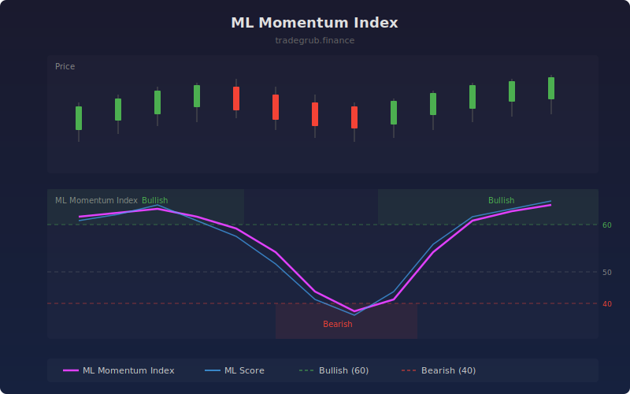

# ML Momentum Index

Combines traditional price momentum with K-Nearest Neighbors classification to identify momentum regime shifts before they become obvious. The model trains on a rolling window of momentum, RSI, and rate-of-change features to predict the probability of continued upward movement.

## How It Works

- Computes traditional momentum, RSI, and rate-of-change as input features
- Trains a KNN classifier on a rolling lookback window to predict next-bar direction
- Outputs the ML probability score (0-100) representing bullish confidence
- Blends the ML score with normalized traditional momentum into a composite index
- Zones above 60 indicate bullish momentum regime, below 40 bearish

## Parameters

| Parameter | Default | Range | Description |
|-----------|---------|-------|-------------|
| Momentum Length | 14 | 5-50 | Period for momentum and RSI calculations |
| K Neighbors | 5 | 3-21 | Number of neighbors for KNN classification |
| Training Lookback | 60 | 30-150 | Rolling window size for model training |

## Outputs

- **ML Momentum Index**: Blended composite score (purple line, 0-100)
- **ML Score**: Raw KNN probability output (blue line, 0-100)
- **Bullish/Bearish/Neutral**: Horizontal reference lines at 60, 40, and 50
- **Background**: Green shading above 60, red shading below 40

## Usage Notes

- Rising ML score crossing above 60 suggests momentum regime shifting bullish
- Divergence between ML score and traditional momentum can signal turning points
- Increase the training lookback for smoother but slower-reacting signals
