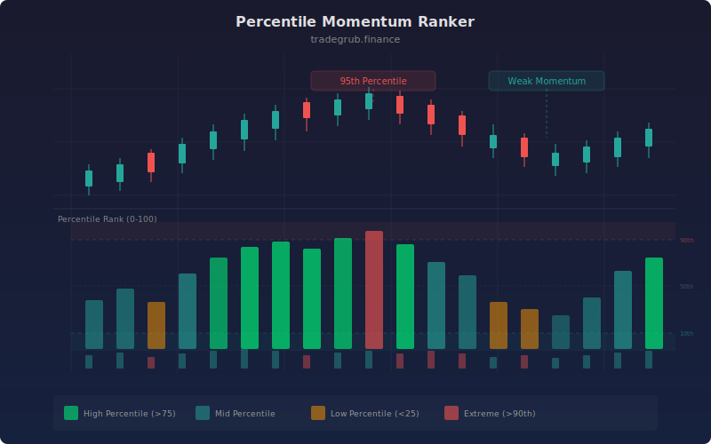

# Percentile Momentum Ranker

Ranks the current bar's momentum against its recent history using rolling percentile calculations. Instead of showing raw momentum values, this indicator tells you where the current momentum stands relative to the lookback window, making it easy to spot when momentum is unusually strong or weak compared to recent behavior.

## Conceptual Diagram



## How It Works

The indicator computes three independent momentum factors. Fast returns measure short-term price change over a configurable number of bars. Slow returns capture the broader trend over a longer window. Volume ratio compares current volume to its rolling average to detect participation surges.

Each factor is converted to a rolling percentile rank using pandas `rolling().rank(pct=True)`. A percentile of 0.90 means the current value exceeds 90% of values in the lookback window. This normalization puts all three factors on the same 0-1 scale regardless of their raw magnitudes.

The composite score blends the three percentile ranks with configurable weights (default: 40% fast, 40% slow, 20% volume) and applies smoothing. The result oscillates between 0 and 100, where readings above 75 indicate momentum in the top quartile and readings below 25 indicate the bottom quartile.

## Parameters

| Parameter | Default | Range | Description |
|-----------|---------|-------|-------------|
| Ranking Window | 20 | 5-100 | Number of bars used for percentile ranking |
| Fast Momentum | 5 | 2-20 | Lookback for short-term return calculation |
| Slow Momentum | 20 | 10-50 | Lookback for longer-term return calculation |
| Smoothing | 3 | 1-10 | SMA smoothing applied to the composite score |
| Show Rank Zones | true | - | Shade background in strong and weak zones |

## Python Advantage

Pandas rolling percentile rank replaces what would require nested loops and manual sorting in other languages:

```python
import pandas as pd

df = pd.DataFrame({'close': close, 'volume': volume})
df['fast_ret'] = df['close'].pct_change(fast_period)
df['fast_rank'] = df['fast_ret'].rolling(lookback).rank(pct=True)

# Composite from multiple ranked factors on a unified 0-1 scale
composite = (df['fast_rank'] * 0.4 + df['slow_rank'] * 0.4 + df['vol_rank'] * 0.2) * 100
```

The `pct_change`, `rolling`, and `rank` chain expresses in three lines what would take dozens of lines with raw array operations.

## When to Use

Apply this indicator on daily or higher timeframes for swing trading decisions. It works best as a filter: only take long entries when the rank is above 50, or look for mean-reversion shorts when the rank exceeds 90. Because it uses percentile ranking, it adapts automatically to each instrument's volatility characteristics.

## Risk Management

Extreme readings (above 90 or below 10) often precede reversals rather than continuations. Treat them as caution signals rather than entry triggers. Combine with price structure analysis to determine whether a high rank reflects a healthy trend or an overextended move.

## Combining with Other Indicators

- **Supply Demand Zones**: Enter long when the rank crosses above 50 at a tested demand zone
- **ATR Trailing Stop**: Use a wider stop when the rank is below 25 (weak momentum, higher reversal odds)
- **Consolidation Quality Score**: High consolidation quality plus rising rank often precedes strong breakouts
